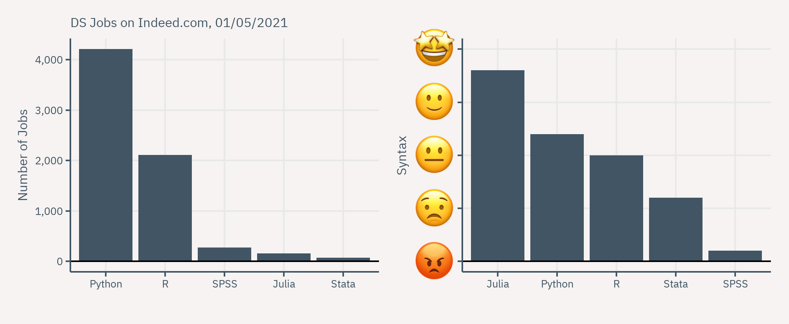
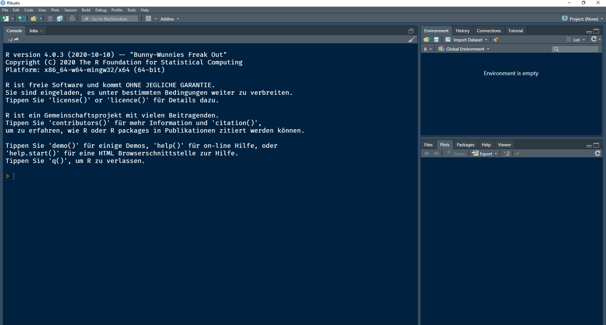
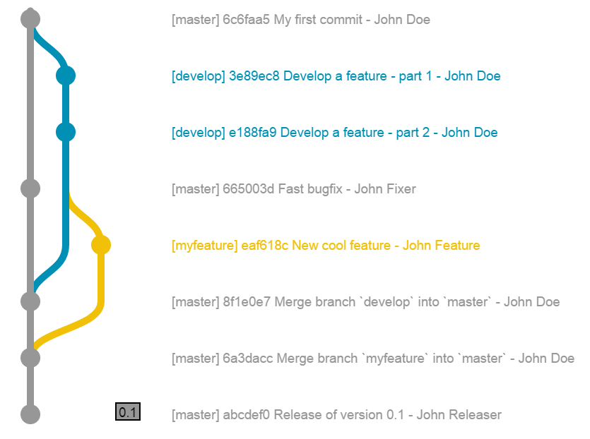

```{r setup, include=FALSE}

knitr::opts_chunk$set(echo = TRUE)

knitr::opts_chunk$set(
  fig.align="center", 
  fig.retina = 2,
  cache=F#, echo=F, warning=F, message=F
  )

#knitr::opts_chunk$set(fig.dim=c(4.8, 4.5), fig.retina=2, out.width="100%")

# install package management tool pacman
# install.packages("pacman")

# devtools::install_github("CorrelAid/datenguideR")

pacman::p_load(
  tidyverse,
  showtext,
  dagitty,
  ggdag,
  data.table,
  patchwork,
  cjpowR,
  raincloudplots,
  rio,
  leaflet
)


font_add_google(
  name = "IBM Plex Sans",
  family = "plex"
)

showtext_auto()


knitr::opts_chunk$set(
  message = FALSE,
  warning = FALSE
)

```


```{r set-ggplot-theme, include=FALSE}

theme_set(theme_classic() +
  theme(
    text = element_text(family = "plex", size = 25, colour="#415564"),
    panel.background = element_rect(fill = "#f6f3f2"), 
    plot.background = element_rect(fill = "#f6f3f2", color = "#f6f3f2"), 
    panel.grid.major = element_line(colour="#e8e8e8"),
    panel.grid.minor = element_blank(), 
    legend.background = element_rect(fill = "#f6f3f2"), 
    legend.box.background = element_rect(fill = "#f6f3f2"), 
    axis.text = element_text(colour="#415564"),
    axis.line = element_line(colour="#415564"),
    axis.title = element_text(colour="#415564"),
    axis.ticks = element_line(colour="#415564"),
  ))

purple <- "#644155"

```


```{r xaringan-scribble, echo=FALSE}
xaringanExtra::use_scribble(pen_color = purple)
```


class: inverse, center, title-slide, middle

<style>
.title-slide .remark-slide-number {
  display: none;
}
</style>

# .title-wrap[Intro to Programming with R for Political Scientists]

<br /> 

## .header-fancy[Session 1: RStudio and Version Control]

### Markus Freitag

### Geschwister Scholl Institute of Political Science, LMU

### [`r icons::icon_style(icons::fontawesome("twitter"), fill = "#415564")`](https://twitter.com/MarkusGFreitag) [`r icons::icon_style(icons::fontawesome("globe"), fill = "#415564")`](https://markusfreitag.netlify.app/)


### `r Sys.Date()`

<a href="https://github.com/m-freitag" class="github-corner" aria-label="View source on Github"><svg width="80" height="80" viewBox="0 0 250 250" style="fill:#415564; color:#f6f3f2; position: absolute; top: 0; border: 0; right: 0;" aria-hidden="true"><path d="M0,0 L115,115 L130,115 L142,142 L250,250 L250,0 Z"></path><path d="M128.3,109.0 C113.8,99.7 119.0,89.6 119.0,89.6 C122.0,82.7 120.5,78.6 120.5,78.6 C119.2,72.0 123.4,76.3 123.4,76.3 C127.3,80.9 125.5,87.3 125.5,87.3 C122.9,97.6 130.6,101.9 134.4,103.2" fill="currentColor" style="transform-origin: 130px 106px;" class="octo-arm"></path><path d="M115.0,115.0 C114.9,115.1 118.7,116.5 119.8,115.4 L133.7,101.6 C136.9,99.2 139.9,98.4 142.2,98.6 C133.8,88.0 127.5,74.4 143.8,58.0 C148.5,53.4 154.0,51.2 159.7,51.0 C160.3,49.4 163.2,43.6 171.4,40.1 C171.4,40.1 176.1,42.5 178.8,56.2 C183.1,58.6 187.2,61.8 190.9,65.4 C194.5,69.0 197.7,73.2 200.1,77.6 C213.8,80.2 216.3,84.9 216.3,84.9 C212.7,93.1 206.9,96.0 205.4,96.6 C205.1,102.4 203.0,107.8 198.3,112.5 C181.9,128.9 168.3,122.5 157.7,114.1 C157.9,116.9 156.7,120.9 152.7,124.9 L141.0,136.5 C139.8,137.7 141.6,141.9 141.8,141.8 Z" fill="currentColor" class="octo-body"></path></svg></a><style>.github-corner:hover .octo-arm{animation:octocat-wave 560ms ease-in-out}@keyframes octocat-wave{0%,100%{transform:rotate(0)}20%,60%{transform:rotate(-25deg)}40%,80%{transform:rotate(10deg)}}@media (max-width:500px){.github-corner:hover .octo-arm{animation:none}.github-corner .octo-arm{animation:octocat-wave 560ms ease-in-out}}</style>

---

class: inverse, center, middle
name: intro

# Intro


---

# Hi!

.hl2[Why this course?]

 - Intro to R with a focus on programming (<-> standard pol sci quant training).
 
 - Set some good programming/workflow habits to make your life easier later on.
 
> *"I want to give a short (crash) course that provides you with some basic practical skills necessary to get serious about (political) sciencing."*

 - There are tons of awesome & free materials from the best R Gurus of the world out there.
 
 - Take this course as a humble starting point to see through the thickit.

.font70[.hl[Note:] Text will be highlighted in .hl[yellow] or .hl2[turquise]. Links will appear [purple]().]

---

# Hi!

**Who am I?**

- Research Fellow (pre-doc). Likes stats and pol sci. Also likes cooking and (board) gaming. 

- Web: [`r icons::icon_style(icons::fontawesome("globe"), fill = "#415564")`](https://markusfreitag.netlify.app/)


**Who are you?**

Let's do a break-out icebreaker session. 

This will also be your team for the problem sets. 


---

# What are we going to cover?

1. .hl[Intro]

2. .hl[R-Studio and Git(Hub)]

3.  Base R & Tidyverse Basics

4.  Data Wrangling I

5.  Data Wrangling II

6.  Data Viz

7.  Writing Functions

8.  A complete scientific workflow with R

---

# Why R?

At the present day (and surely years to come), R is arguably the best programming language for academics:

- R is from statisticians for statisticians.

- Most active (academic) development community for **statistical** computing/programming.

- Nice IDEs; Good integration of other languages and workflow components.

- Best for data viz.


---

# Why R?



---


# R versus other langs/software

```{r, echo=FALSE, fig.align='center', out.width= "73%"}
knitr::include_graphics("Figs/benchmarks.svg")
```
<center> Source: [Julia Micro-Benchmarks](https://julialang.org/benchmarks/). <center/>

---

# Showcase

U can make pretty graphs...

```{r, echo = FALSE, fig.width = 13, fig.align='center', out.width= "70%"}

elbe <- import("1998_2002.dta") # import Hainmueller et al. replication data.

elbe <- elbe %>%
  filter(year == 2002)

elbe_t <- elbe  %>% 
  filter(Flooded == 1)

elbe_c <- elbe %>%
  filter(Flooded != 1)

df_1x1 <- data_1x1(
  array_1 = elbe_c$del_spd_z_vs,
  array_2 = elbe_t$del_spd_z_vs,
  jit_distance = .09,
  jit_seed = 321
)

# df_1x1 <- data_1x1(
#   array_1 = iris$Sepal.Length[1:50],
#   array_2 = iris$Sepal.Length[51:100],
#   jit_distance = .08,
#   jit_seed = 321)


raincloud_1 <- raincloud_1x1_repmes(
  data = df_1x1,
  colors = (c("#415564", "#a80000")),
  fills = (c("#415564", "#a80000")),
  line_color = 'gray',
  line_alpha = 0,
  size = 1,
  alpha = .3,
  align_clouds = FALSE) + scale_x_continuous(breaks = c(1, 2), labels = c("Not Flooded", "Flooded"), limits = c(0, 3)) +
  xlab("\n2002 Elbe Flooding") +
  ylab("Change in \nSPD Vote Share \n2002 - 1998 (in pp.)") +
  theme_classic() + theme(
    text = element_text(family = "plex", size = 25, colour = "#415564"),
    panel.background = element_rect(fill = "#f6f3f2"),
    plot.background = element_rect(fill = "#f6f3f2", color = "#f6f3f2"),
    panel.grid.major = element_line(colour = "#e8e8e8"),
    panel.grid.minor = element_blank(),
    legend.background = element_rect(fill = "#f6f3f2"),
    legend.box.background = element_rect(fill = "#f6f3f2"),
    axis.text = element_text(colour = "#415564"),
    axis.line = element_line(colour = "#415564"),
    axis.title = element_text(colour = "#415564"),
    axis.ticks = element_line(colour = "#415564"),
    axis.title.y = element_text(angle = 0, vjust = 0.5)
  )

plot(raincloud_1)

```
<center> Data from [Haimueller/Bechtel 2011](https://web.stanford.edu/~jhain/Paper/AJPS2011.pdf). <center/>

---

# Showcase

U can make pretty [graphs](https://www.economist.com/graphic-detail/2021/04/13/in-america-republican-led-states-are-rolling-back-electoral-and-civil-liberties)...

<div align="center">

</div>

---

# Showcase

Or [maps](https://timogrossenbacher.ch/2019/04/bivariate-maps-with-ggplot2-and-sf/)...

```{r, echo=FALSE, fig.align='center', out.width= "60%"}
knitr::include_graphics("Figs/map_ineq.png")
```


---

# Showcase

Or interactive graphs...

.pull-left[
```{r, echo=FALSE}

p <- cjpowr_plotly(
  y = "n", x = "amce", by = "power",
  amce = seq(from = 0.02, to = 0.1, length.out = 1000),
  power = c(0.7, 0.8, 0.9),
  alpha = 0.05,
  levels = 5,
  delta0 = 0.5
) %>% plotly::layout(
  plot_bgcolor = "rgb(246, 243, 242)",
  paper_bgcolor = "rgb(246, 243, 242)",
  fig_bgcolor = "rgb(246, 243, 242)"
)
p
```
]

.pull-right[
<div align="center">

</div>

If you are interested in [power for (conjoint/factorial) survey experiments](https://github.com/m-freitag/cjpowR)...

]

---

# Showcase

Or or interactive maps...

<center>
```{r, echo = FALSE, fig.height=6, eval=require('leaflet'), fig.align='center'}

# pois <- import("https://www.opengov-muenchen.de/dataset/fc28edb7-0e69-47b2-814e-3fa18c68f94f/resource/6fb56066-11b2-498d-ba22-cbcc85b660b4/download/pois-an-der-isar-2016-08-09.csv", encoding = "UTF-8")
# export(pois, "pois.csv")
pois <- import("pois.csv", encoding = "UTF-8")

gsi <- data.frame(type = "gsi",
  title = "GSI",
  latitude = 48.149533064606445,
  longitude = 11.594370092103917,
  description = "Home Sweet Home!", 
  photo_url = "",    
  photo_credit = "", 
  url_website= ""
  )
pois <- rbind(pois, gsi)

pois$description <- paste0(pois$title, ":\n", pois$description)

pois$gsi <- ifelse(pois$title == "GSI", 1,0)


getColor <- function(pois) {
  sapply(pois$gsi, function(gsi) {
  if(gsi == 0) {
    "green"
  } else if(gsi == 1) {
    "orange"
  } })
}

icons <- awesomeIcons(
  icon = 'ios-close',
  iconColor = 'black',
  library = 'ion',
  markerColor = getColor(pois)
)

leaflet(data = pois) %>%
  addTiles() %>%
  addAwesomeMarkers(~longitude, ~latitude, popup = ~ as.character(description), icon = icons)

```
<center/>

.font60[Map shows [points of interest](https://www.opengov-muenchen.de/dataset/points-of-interest-an-der-sudlichen-isar) 
at the southern part of the Isar in Munich (GSI in orange). Let summer come!]
---

# Showcase

- U can easily combine R code and text in so called Rmarkdown files to produce 
reproducible documents in various output formats (html, pdf, etc.).

- This presentation is a (hopefully good) example. You can check out the source code 
[here](). Feel free to take and adapt. 

- We will learn a little more about this in just a few slides and much more tomorrow!

---

class: inverse, center, middle
name: intro

# R-Studio & Git(Hub)


---

# Installation

Steps you should have done already:

1.  Install [R](https://www.r-project.org/).

2.  Install [R-Studio](https://www.rstudio.com/products/rstudio/download/#download).

3.  Create a [GitHub](https://github.com/) account. Take some care with the user-name if you want to keep this account throughout your career. You can't change it afterwards.

4.  Install and set up [Git](https://git-scm.com/downloads) (and optionally a desktop client).


---

# R-Studio

R-Studio is an IDE (integrated development environment) for the R language:

- comes with a console, code editor, tools for plotting, history, debugging and workspace

- open source

- pretty accessible/easy to use

Alternatives:

- Visual Studio Code (nice, if you work with multiple langs; my fav IDE)

- Alternatives are worse for package development, shiny platforms and some other R-specific stuff 
- If your main language is R, RStudio is best


---

# R-Studio

Lets take a tour...


```{r, echo=FALSE, fig.align='center', out.width="75%"}

```

---

# A Small Detour: Two Types of "Scripts"

In this course, we will use two types of scripts to write our code:

1. Classic R-Scripts (`.R`): simple text file; comments are usually done like so: `# A comment.`

2. [Rmarkdown](https://rmarkdown.rstudio.com/lesson-1.html) files (`.rmd`): combines code and free text (+ figures and formulae)

  - Can be "knitted" to, e.g., .pdf, .html and Word
  
  - Makes your documents (e.g. a paper or a thesis) fully reproducible (more on this tomorrow!)
  
  - Nice for problem sets (hence, we will use it for this right from the beginning)
  
  
---

# Rmarkdown

An Rmarkdown file consists of mainly three things:

1. **YAML header** (Yet Another Markdown Language). Specifies meta info (e.g. author, date, document format, etc.):

```{yaml, eval = FALSE}
---
title: "Untitled"
author: Markus
output: html_document
---

```

2\. **Code chunks** sorrounded by ` ``` `. You can execute each chunk individually. 

3\. Plain text formatted via Markdown, a markup language with very [easy syntax](https://www.rstudio.com/wp-content/uploads/2015/03/rmarkdown-reference.pdf).

Problem sets will come as pre-formatted `.rmd` files such that you can start working on excercises directly. 

---

# R projects

- To keep our sanity when coding (and to produce something reproducible in the end), we want to keep all our data, analysis scripts, outputs (e.g. figures) etc. together.

**Three approaches:**

**<span style="color: red;">Bad</span>**

> Creating a folder in the explorer and dropping all files into it. Setting the working directory in the R script manually using, e.g., `setwd("C:/Users/XYZ/New Folder")`.

Just don't use `setwd()`. Ever.<sup>1</sup>

Why? Reproducibility.

.footnote[[1] Yes, I am looking at you, Stata user, who loves to set working directories via `cd`.]

---

# R projects


**<span style="color: #eaaf0e;">Ok</span>**

> Clicking , creating a local "R-Project".

This creates a folder with an `.Rproj` file. Whenever you open an R-project, a fresh instance of R starts and **the current working directory is set to the project directory.** You can then work with file paths relative to the project directory: E.g. `Figures/somepicture.png")`.


**<span style="color: #03bc0d;">Good</span>**

> Creating a project and using version control.

This is where Git(Hub) comes in...


---

# Why Git(Hub)?

Having multiple scripts inside your project called, e.g., `thesis_analysis_final_01_revised_2.R` is a nightmare.

- Using Git(Hub) improves your workflow:

    - helps with keeping track of the changes you do. 
    - makes (code) collaboration with other researchers easy. 
    - helps to make your research/code projects accessible/reproducible/open source.  

---

# Why Git(Hub)?

What's that thing called "Git"?

- It's a version control system:

$$ \text{Git} \approx \text{MsOffice track changes and restore features} + \text{dropbox/google drive version history}$$
- But it's better, especially for any kind of projects that involve code

- You have to "commit" (i.e. save) actively, but that's a good thing (you could still have some sort of auto-save on you local machine)!


---

# Why Git(Hub)?

<div align="center">

</div>

---

# GitHub

GitHub to the rescue:

- Built on top of Git

- A kind of online cloud service that makes working with Git easier

- again, no automated sync (but that's good!)

- Instead of some folder, your project lives in a remote **repository**

--

.hl[The remote repository is your upstream storage.]

&#x2192; You can **clone** it from GitHub to create a local copy.

&#x2192; You can **fork** some repo (including those of other users); i.e. create a copy of the repo under "your repositories". You can then **clone** this forked repo to get a local copy.

---

# Your first repo

1. Click [here](https://github.com/new) and create a new Git(Hub) repo. Call it "test", set it to .hl[private] and initialize with a readme file.

2. In R-Studio, navigate to `File > New Project > Version Control > Git`.

3. Paste the Repository URL, chose a name and project path and **clone** the thing.

4. You will be asked to provide a personal access token. Generate it [here](https://github.com/settings/tokens) using some name and check the "repo box".

5. In the files tab, open README.md. Also click on the Git tab.

Do this .hl[now]!

---

# 4 Operations You Need to Know

1. .hl[Stage] ("add")

  - Tells Git which files u want to make changes (edits, deletes, etc.) to in the repo (simplification); in R-Studio this boils down to "selecting" files/changes to files by checking them.

2. .hl[Commit]

  - Git's way to "save" the changes you staged.

3. .hl[Pull] 

  - "downloads" all new changes/new commits from GitHub
  
4. .hl[Push] (to origin)

  - "uploads" all commits to GitHub; to the origin, i.e. your upstream remote repo.

---

# Commit

Make some changes to the `README.md` file, stage, commit and push.

To establish best practice, give your commit a meaningful name:

```{r, echo=FALSE, fig.align='center'}
knitr::include_graphics("Figs/git_commit.png")
```

- In general, commit whenever you think you made a meaningful change

- Push a bit less often than you commit

---

# Collaborate with Git(Hub)

- Using version control really comes to shine when collaborating.

- BUT: you are always collaborating. With your future self. Therefore, always use version control.

- To invite someone to a repo on GitHub, go to the repo `settings > manage access`.

- Your collaborator can then clone the repo and contribute commits, push them etc.


---

# When Things Go Sideways: Merge Conflicts

1. Go to your new repo. Edit the README.md manually in line **3**.

2. Commit some changes in the **same** line locally in R-Studio. Commit.

3. Pull (don't push).

4. Git: 


---

# When Things Go Sideways: Merge Conflicts

What do you do now?

- Well, you (maybe in exchange with your collaborator) decide!

- Solve the conflict manually, add, commit, push.

---

# Branches

```{r, echo=FALSE, fig.align='center', out.width= "50%"}

```


---

# Branches

- [Branches](https://git-scm.com/book/de/v2/Git-Branching-Branches-auf-einen-Blick) allow you to develop/test some idea without touching the main version of your code.

- Useful for larger projects. You get a full copy of the repo and you can commit/pull/push all you want. 

- If your idea turned out not to work. Just delete the branch.

- In R-Studio, they can be created **via the little purple branch icon in the Git tab**.

- If you want to integrate the feature/idea into the main branch, issue a [pull request](https://docs.github.com/en/github/collaborating-with-pull-requests/proposing-changes-to-your-work-with-pull-requests/about-pull-requests) (easiest way is via GitHub).


---

# When Things Go Really, Really Wrong

.pull-left[
- DON'T PUSH.

- If you did not, just clone a fresh instance of the repo.

- If you did, you can revert to an older version (but that's more work). 
]

.pull-right[

]

---

# Workflow Summary

1. Create a repo or fork some existing repo

2. Invite collaborators

3. Clone it & create an R project

4. Edit code or make other changes

5. Stage, commit (with message), pull (esp. if u work with others/to avoid conflicts right away), push

6. Rinse and repeat steps 4-5.

---

# Workflow Summary

Yes, the order really is stage, commit, pull, push.

Well, we got an intuition for it when we created a merge conflict. See this concise [stackoverflow](https://stackoverflow.com/questions/47465841/pull-commit-push-or-commit-pull-push) answer for a summary:

> It's better to commit first. Pulling without commiting may make your work overwritten. With a local commit, conflicts will be shown and prompted for manual merging when pulling, giving you a better control over your work.

---

# Further Steps

- .hl[Fork the course repo and clone it via R-Studio (that's perhaps a bit hacky but easy and does the job).]

- You will need this to conveniently access the course materials/problem sets.

- As the fork is your own copy of the repo, feel free to commit and push all you want.

- You could also use the [shell](https://happygitwithr.com/shell.html) to clone the repo or, alternatively, GitHub Desktop

- For beginners, using a Git GUI (like GitHub Desktop) and R-Studio will cover well over 90% of the use cases imo

See, e.g., [here](https://happygitwithr.com) for further reading.

---

class: inverse, center, middle
name: intro

# Next Up: Base R & the Tidyverse

```{r print pdf, include=FALSE}

pagedown::chrome_print("./Intro.html")

```

```{r xaringanExtra-share-again, echo=FALSE}
xaringanExtra::use_share_again()
```

