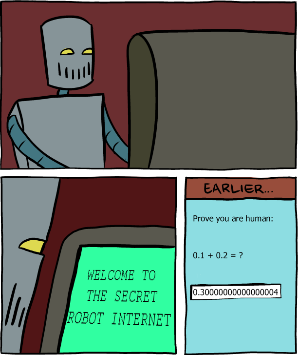
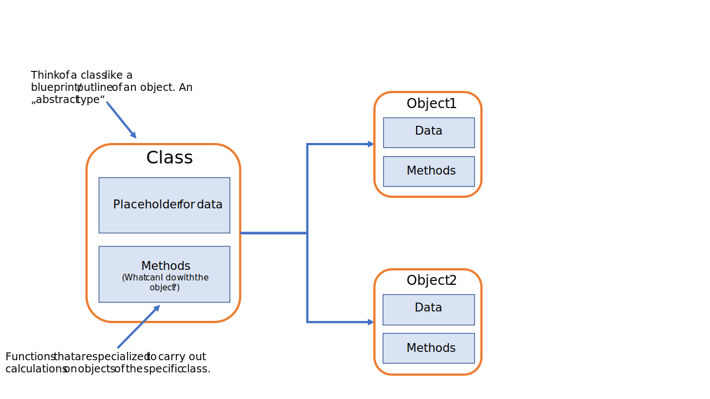
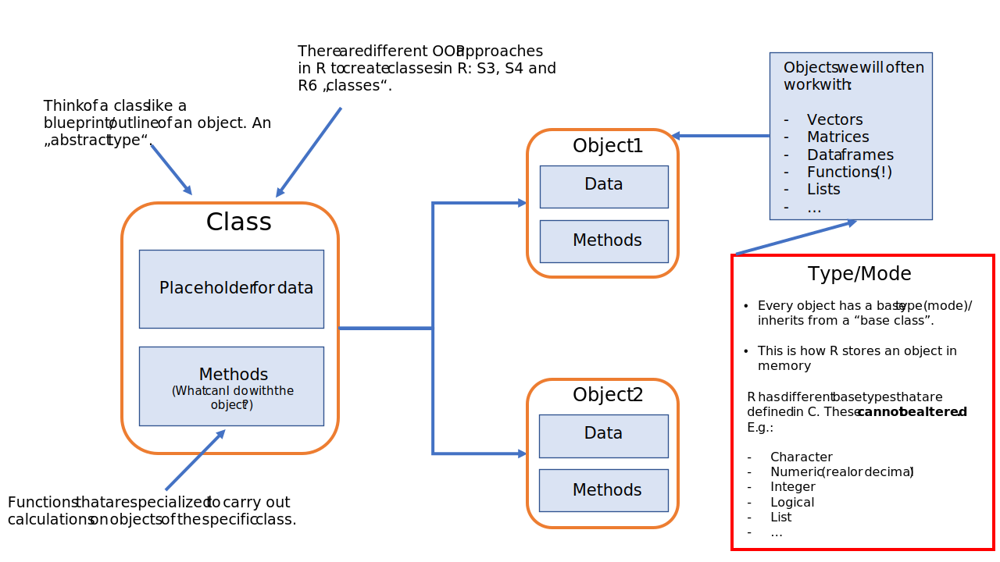

```{r setup, include=FALSE}

knitr::opts_chunk$set(echo = TRUE)

knitr::opts_chunk$set(
  fig.align = "center",
  fig.retina = 2,
  cache = F # , echo=F, warning=F, message=F
)

# knitr::opts_chunk$set(fig.dim=c(4.8, 4.5), fig.retina=2, out.width="100%")

# install package management tool pacman
# install.packages("pacman")

# devtools::install_github("CorrelAid/datenguideR")

pacman::p_load(
  tidyverse,
  showtext,
  dagitty,
  ggdag,
  data.table,
  patchwork,
  rvest,
  modelsummary
)


# font_add_google(
#   name = "IBM Plex Sans",
#   family = "plex"
# )

# showtext_auto()


knitr::opts_chunk$set(
  message = FALSE,
  warning = FALSE
)
```


```{r set-ggplot-theme, include=FALSE}

theme_set(theme_classic() +
  theme(
    text = element_text(family = "plex", size = 25, colour = "#415564"),
    panel.background = element_rect(fill = "#f6f3f2"),
    plot.background = element_rect(fill = "#f6f3f2", color = "#f6f3f2"),
    panel.grid.major = element_line(colour = "#e8e8e8"),
    panel.grid.minor = element_blank(),
    legend.background = element_rect(fill = "#f6f3f2"),
    legend.box.background = element_rect(fill = "#f6f3f2"),
    axis.text = element_text(colour = "#415564"),
    axis.line = element_line(colour = "#415564"),
    axis.title = element_text(colour = "#415564"),
    axis.ticks = element_line(colour = "#415564"),
  ))

purple <- "#644155"
```


```{r xaringan-scribble, echo=FALSE}
xaringanExtra::use_scribble(pen_color = purple)
```


class: inverse, center, title-slide, middle

<style> .title-slide .remark-slide-number {
  display: none;
} </style>

# .title-wrap[Intro to Programming with R for Political Scientists]

<br />

## .header-fancy[Session 2: Base R and Tidyverse Basics]

### Markus Freitag

### Geschwister Scholl Institute of Political Science, LMU

### [`r icons::icon_style(icons::fontawesome("twitter"), fill = "#415564")`](https://twitter.com/MarkusGFreitag) [`r icons::icon_style(icons::fontawesome("globe"), fill = "#415564")`](https://markusfreitag.netlify.app/)


### July 12, 2021

<a href="https://github.com/m-freitag" class="github-corner" aria-label="View
source on Github"><svg width="80" height="80" viewBox="0 0 250 250"
style="fill:#415564; color:#f6f3f2; position: absolute; top: 0; border: 0;
right: 0;" aria-hidden="true"><path d="M0,0 L115,115 L130,115 L142,142 L250,250
L250,0 Z"></path><path d="M128.3,109.0 C113.8,99.7 119.0,89.6 119.0,89.6
C122.0,82.7 120.5,78.6 120.5,78.6 C119.2,72.0 123.4,76.3 123.4,76.3 C127.3,80.9
125.5,87.3 125.5,87.3 C122.9,97.6 130.6,101.9 134.4,103.2" fill="currentColor"
style="transform-origin: 130px 106px;" class="octo-arm"></path><path
d="M115.0,115.0 C114.9,115.1 118.7,116.5 119.8,115.4 L133.7,101.6 C136.9,99.2
139.9,98.4 142.2,98.6 C133.8,88.0 127.5,74.4 143.8,58.0 C148.5,53.4 154.0,51.2
159.7,51.0 C160.3,49.4 163.2,43.6 171.4,40.1 C171.4,40.1 176.1,42.5 178.8,56.2
C183.1,58.6 187.2,61.8 190.9,65.4 C194.5,69.0 197.7,73.2 200.1,77.6 C213.8,80.2
216.3,84.9 216.3,84.9 C212.7,93.1 206.9,96.0 205.4,96.6 C205.1,102.4
203.0,107.8 198.3,112.5 C181.9,128.9 168.3,122.5 157.7,114.1 C157.9,116.9
156.7,120.9 152.7,124.9 L141.0,136.5 C139.8,137.7 141.6,141.9 141.8,141.8 Z"
fill="currentColor"
class="octo-body"></path></svg></a><style>.github-corner:hover
.octo-arm{animation:octocat-wave 560ms ease-in-out}@keyframes
octocat-wave{0%,100%{transform:rotate(0)}20%,60%{transform:rotate(-25deg)}40%,80%{transform:rotate(10deg)}}@media
(max-width:500px){.github-corner:hover .octo-arm{animation:none}.github-corner
.octo-arm{animation:octocat-wave 560ms ease-in-out}}</style>

---
# Overview

1. Intro + R-Studio and (Git)Hub

2. .hl[Base R & Tidyverse Basics]

3. Data Wrangling

4. Data Viz

5. Writing Functions

6. A complete scientific workflow with R

---
# Trivia

- R was designed in 1993 by Ross Ihaka and Robert Gentleman.

- It builds on the S programming language by John Chambers.

```{r, echo=FALSE, fig.align='center', out.width= "25%"}

```
.center[.font50[[Image source and more R-History
trivia](https://rss.onlinelibrary.wiley.com/doi/epdf/10.1111/j.1740-9713.2018.01169.x)]]

  - Was named R as a play on S and because of the first names of the authors.

--

```{r, echo = FALSE, results='hide'}

CRANpackages <- available.packages()
nrow(CRANpackages)

nb_pkgs <- nrow(CRANpackages)
```

- There are `r nb_pkgs` packages available on [CRAN](https://cran.r-project.org/) as of `r Sys.Date()`.

- [R-Studio](https://www.rstudio.com/about/) $\neq$ [R-Core Team](https://www.r-project.org/contributors.html); 
the former is a mix of a for-profit and a non-profit company; highly committed to producing free & open-source products; has some business solutions.


---

# Workflow
[//]: # (ANCHOR Workflow)

- You forked and cloned the course repo.

- Navigate to `Session Scripts > Session 2` and open `Session_2_script.R`.

- You will see a pre-formatted Script containing some helpful information on comments and formatting.

- The script contains everything I do on the slides.

--
  
- Make comments for yourself. Explore as you follow. Stage, commit, and push.

- Hopefully not you &rightarrow; 

- If you have a second monitor, great! If not, split your screen.


---

class: inverse, center, middle name: intro

# CalculatoR


---

# CalculatoR

```{r}

7 + 5 # [n] stands for the nth element printed to the console.

4 * 5 + 2 / 3^3 # Multiplication and division first, then addition and subtraction

```

--

```{r}

# Modulo Operators:

10 %/% 3 # Integer division

10 %% 3 # Remainder ("Rest")
```

---

# CalculatoR

.hl[Relational and logical operators]

.pull-left[

.code60[
.details[  
```{r}
3 < 4
```
]

.details[
```{r}
2 == 1 & 4 > 2 # == "equal to"; & "element wise logical AND"
```
]

.details[
```{r}
2 == 1 | 4 > 2 # | "element wise logical or"
```
]
]
]

--

.pull-right[
.code60[  
```{r}
3 != 4 # != "not equal"

7 %in% 300:500 # %in% can be used to evaluate matches in objects
```
]
Take care about the order of precedence (mostly left to right)...
]


---
# CalculatoR

.pull-left[
```{r}
# Floating Points

0.1 + 0.2
```
.details[
```{r}
0.1 + 0.2 == 0.3
```
]

]

--

.pull-right[

.font80[
.hl2[Why?!]

> [Because internally, computers use a format (binary floating-point) that cannot accurately represent a number like 0.1, 0.2 or 0.3 at all.](https://floating-point-gui.de/basic/)
]

```{r, echo=FALSE, fig.align='center', out.width= "60%"}

```

]

---

class: inverse, center, middle name: intro

# A Primer on OOP ("Object Oriented Programming")

---

# Object Oriented Programming

> Everything is an object, and everything has a name.

```{r, echo=FALSE, fig.align='center', out.width= "80%"}

```


---

# Object Oriented Programming

> Everything is an object and everything has a name.

```{r, echo=FALSE, fig.align='center', out.width= "80%"}

```

---

# Functions

- [Functions](https://cran.r-project.org/doc/manuals/r-release/R-lang.html#Function-objects) are objects; we will discuss them in more detail in Session [5](https://m-freitag.github.io/intro-r-polsci/Session5/).

- For now, just think of them in the usual mathematical sense, where we pass some argument and get back a value. E.g. $f(x) = \frac{2x + 3}{\sqrt{3}}$.

- In R, one or multiple arguments (separated by commas) get passed to the function body (where the function is defined), and you get back some results.

--

- For instance, to define the above function and call it, we specify the following:

.code70[
```{r}
f <- function(x) {
  (2 * x + 3) / sqrt(3)
}

f(x = 3) # omitting argument names, e.g. f(3), works too. But we then need to pay attention to the order in which we pass the values!
```

]

---

# Functions

- There are many functions in R; some are written by users and scientists and were put into some package, some are built-in functions of "base" R.<sup>.font70[[1]]</sup>

- A really helpful built-in function - in the literal sense - is the... `help()` function.

- It gives you more information about the usage and arguments of a built-in/user-written function.

--
  
We can also call `help()` to get help about help:
```{r, results = "hide", eval=FALSE}
# help(help)
# Or for short:
?help
```


- But let's not get ahead of ourselves... what did this arrow (`<-`) thing do?

.font70[<sup>[1]</sup>.hl[Fine Point:] The arithmetic, logical and relational
operators we met are actually also function calls.]

---

# Making Objects: Assignment (Operators)

.pull-left[
- You can use `<-` or `=` for assignment

- For instance,

.code50[
```{r}
a <- 3 # Or a = 3; under the hood, assignment works more like a -> 3
```
]

assigns the name `x` to an object of type/mode numeric holding the value 3.
I.e., binds an object to a name.

Simplification:
> creates an object named `a`, containing the value `3`.
]

--

.pull-right[

-Using
```{r, results= "hide"}
class(a)
mode(a)
```
gives you information about the class/type of the object. `class()` gives the
class of the object from an OOP POV, `typeof()` (or `mode()`)the base type.

- In this case, this is not very interesting as we created an .hl2[atomic] numeric vector.

- What is the class/type  of `b <- 3 > 2` and `c <- "string"`?

]

---

# Making Objects: Assignment (Operators)

- Using `=` is legal as per the man, the myth, the legend Ross Ihaka himself:

<center><iframe width="560" height="315"
src="https://www.youtube.com/embed/88TftllIjaY?start=2100" title="YouTube video
player" frameborder="0" allow="accelerometer; autoplay; clipboard-write;
encrypted-media; gyroscope; picture-in-picture"
allowfullscreen></iframe></center>

- But there are also some sensible arguments to stick mostly to `<-` (e.g., readability: easier to discriminate from function arguments)

- Bottom line: .hl[be consistent].

---

# Naming Conventions

- For readability, we want names of/bound to objects to be meaningful.

- Pretty easy to do when working with "real" data; laziness pretty much the only obstacle ;)

- There are several naming conventions. Most common are `snake_case` and `camelCase`. We will use `snake_case` in this course.

- .hl[Be consistent].

- There are some ["forbidden"/"reserved" words](https://stat.ethz.ch/R-manual/R-devel/library/base/html/Reserved.html)
that cannot be assigned as names. E.g., `NA` (logical constant indicating
missing values), `if`, `else`, `break`.

---

# Workspace/Environment

- In contrast to Stata (< version 16), R can hold multiple objects at a time.

- This is very convenient; you can copy objects, modify them, etc. R also copies .hl2[ALOT] internally (one reason why it's sort of a slow language).

- The global environment is the interactive workspace you usually work with.

- In R-Studio you can inspect some objects by clicking on them (equivalent to calling `View()`)

--

- We won't go into the details of environments but see [here](https://adv-r.hadley.nz/environments.html)
for an advanced treatment.

- This will get more intuitive soon (e.g., when we take on different data structures on the next few slided)

---

# Vectors


- Vectors are the most fundamental data structure in R (actually, .hl2[everything is a vector]).

- As vectors in R have to be of the same type (e.g., numeric), they
are often called .hl2[atomic] vectors.

- If you type a number, R "sees" it as double-width floating-point atomic vector of length one.

.font80[
- *[Technical Fine Point:](https://adv-r.hadley.nz/vectors-chap.html)* Vectors have attributes, importantly dimension and class.
With the dimension attribute, vectors can become arrays and matrices. With the
class attribute, we can build an S3 object on top of the base type (see e.g.
factor type).
]

--

We can build longer vectors by concenating shorter ones using the `c()`
function:

.code60[
```{r, results= "hide"}
chr_var <- c("a", "b", "c", "d") # A 4-element atomic vector of type character
```
]

Indexing:

.code60[
```{r, results= "hide"}
chr_var[3] # Returns the third element of object "chr_var".
chr_var[1:3] # Returns the 1st three.
```
]

---

# Lists

- Objects of type list are highly versatile. They are vectors but more "generic".

- I.e. elements of a list can have different types.<sup>.font70[[2]]</sup>

For example:
```{r, results= "hide"}
list_a <- list(
  5:7,
  "I'm a string",
  c(TRUE, TRUE),
  c(1.23, 4.20)
)

```
constructs a list using the function `list()`.

.font70[<sup>[2]</sup>.hl[Fine Point:] A list does not *store* objects of
different types. Instead, it references to them. As you may have inferred yourself, the 
`:` operator makes sequences. In this case, a numeric vector.]

---

# Indexing Lists


.pull-left[
.code60[  
.details[  
```{r}
list_a[3] # This returns a list with element three.
```
]
.details[
```{r}
list_a[[4]] # We need double brackets to index a list element.
```
]
.details[
```{r}
# Index within a list element:
list_a[[4]][2]
```
]
]
]

.pull-right[
.code60[
.details[     
```{r}
# For named lists, we can index with $:
names(list_a) <- c("a", "b", "c", "d") 
# Note: We can also name elements directly: list(x = 1, y = 2)
list_a$b
```
]
.details[
```{r}
list_a$d[1]
```
]
.details[
```{r}
# Adding a new object-reference, 
# i.e. an element, to a list:
list_a$e <- c("R", "is fun")

```
]
]
]

---
  
# Factors

- To represent categorical variables, we often use factor objects in R (e.g., 
makes it easier to get counts of all categories).

- They are build on top of integer vectors and come with a levels attribute.

.code70[
```{r}
backgrounds_char <- c("none", "Stata", "Stata", "Stata", "R") # Student's prog. backgrounds
backgrounds_fac <- factor(backgrounds_char, levels = c("none", "Stata", "R")) # Or:
# backgrounds_fac <- factor(c("none", "Stata", "Stata", "Stata", "R"))
```
]

--

.code70[
.pull-left[
```{r}
class(backgrounds_fac)
```
]
]

.code70[
.pull-right[
```{r}
typeof(backgrounds_fac)
```
]
]
.code70[
.pull-left[
```{r chunka, eval=FALSE}
table(backgrounds_fac) # -> output to the right
```
]
]
.code70[
.pull-right[
```{r chunka-out, ref.label="chunka", echo=FALSE}
```
]
]

---

# Data Frames

- Data frames are special lists: lists of evenly sized vectors.

- You likely already have a grasp for their structure from 
Stata or other software; they are crucial for data analysis 
&rarr; the rectangle we love.

.code60[
.pull-left[
```{r chunkb, eval=FALSE}
set.seed(666)
df_langs <- data.frame(
  background = factor(c(
    "Python",
    "Stata", "Stata", "Stata",
    "R"
  )),
  skill = rnorm(5) # draw 5 random numbers from a normal dist.
)
# View(df_langs)
head(df_langs) # print first few lines of an object (6 by default)
```
]
]

.code60[
.pull-right[
```{r chunkb-out, ref.label="chunkb", echo=FALSE}
```
]
]

---

# Indexing Data Frames

.details[
```{r}
df_langs[2, 2] # Second row of second column
```
]

.details[
```{r}
df_langs$background[1]
```
]

.details[
```{r}
# Combined with the operators we learned, we can also filter:
df_langs[df_langs$skill < 0, ] 
```
]

---

# Data Frames

- So we have an $\color{#e59e34}n$ (num. of obs.) $\times$ $\color{#5cb194}k$ 
(num. of vars) matrix with observations $\color{#e59e34}i \in \{\color{#e59e34}{1,\dots,n}\}$ and 
variables $\color{#5cb194}j \in \{\color{#5cb194}{1,\dots,k}\}$.

```{r, eval = FALSE}
dim(df_langs)
```
.remark-inline-output[\#\# [1] .hl[5] .hl2[2]]

$$
\begin{align}
  \mathbf{X} =
  \begin{bmatrix}
    x_{\color{#e59e34}{1},\color{#5cb194}{1}} & x_{\color{#e59e34}{1},\color{#5cb194}{2}} & \cdots & x_{\color{#e59e34}{1},\color{#5cb194}{k}} \\
    x_{\color{#e59e34}{2},\color{#5cb194}{1}} & x_{\color{#e59e34}{2},\color{#5cb194}{2}} & \cdots & x_{\color{#e59e34}{2},\color{#5cb194}{k}} \\
    \vdots  & \vdots  & \ddots & \vdots \\
    x_{\color{#e59e34}{n},\color{#5cb194}{1}} & x_{\color{#e59e34}{n},\color{#5cb194}{2}} & \cdots & x_{\color{#e59e34}{n},\color{#5cb194}{k}}
  \end{bmatrix}
\end{align}
$$

- `nrow(df_langs)` = .remark-inline-output[\#\# [1] .hl[5]]; `ncol(df_langs)` = .remark-inline-output[\#\# [1] .hl2[2]]
- `df_langs[1,2]`: $\left( \color{#e59e34}{i = 1} \right)$ and $\left( \color{#5cb194}{j = 2} \right)$


---

# Data Frames

- When passing columns of a data frame (or lists etc.), we need need to take care that the
named references to them "live" inside the data frame and not in the global
environment.


```{r, error = TRUE}
lm(skill ~ background) # the lm object is of type list

```


---

# Data Frames


.code60[
.details[   
```{r}
m1 <- lm(df_langs$skill ~ df_langs$background) # [3]; Or: lm(skill ~ background, data = df_langs)
summary(m1) # generic function used to produce result summaries of the results of various model fitting functions

```
]
]

.font70[<sup>[3]</sup>.hl[NOTE:] The formula object/class is built on the base 
type "language" and important for many stats applications.]

---

# Data Frames

- This is a good timing to also plug Vincent Arel-Bundocks' nice package 
[modelsummary](https://github.com/vincentarelbundock/modelsummary). 

- Makes perfectly formated regression tables/coef. plots for HTML/MD/LaTeX/Word/etc. a one-liner.

- I also has nice data summary functions, which we will use next session. 

---

# Data Frames

  Result:

```{r, echo = FALSE, out.width = "50%"}
m1 <- lm(skill ~ background, df_langs)
add_rows <- data.frame(coefficient = "Python (reference)", model = NA)
attr(add_rows, "position") <- 2

modelsummary(m1,
  add_rows = add_rows,
  coef_rename = c("backgroundR" = "R", "backgroundStata" = "Stata"),
  estimate = "{estimate} ({std.error})",
  statistic = NULL
)  %>%  kableExtra::kable_styling(font_size = 19)
```
---
  
# Type Conversion  

In most cases, we can also convert an object to another type. Sometimes this has side-effects.

.pull-left[.code70[.details[
```{r}
df_langs_m <- as.matrix(df_langs) # convert data.frame to matrix
print(df_langs_m)
```
]
]
]

.pull-right[.code70[.details[
```{r}
typeof(df_langs_m[2, 1])
```
]
]
]

- As matrices are atomic, an implicit coercion happened.<sup>.font70[[4]]</sup>

- If stuff cannot get converted, you get NAs.

.font70[<sup>[4]</sup>.hl[Fine Point:] Coercion order is character > 
double > integer > logical.]


---
  
# Loading/Installing Packages

Classic:
```{r, eval = FALSE}
install.packages("tidyverse")
library(tidyverse)
```
If you are lazy (...for CRAN packages; recommended only for smaller projects/problem sets):
```{r, eval = FALSE}
install.packages("pacman")

pacman::p_load(
  tidyverse,
  patchwork,
  rio,
  data.table
)
```

---

# Loading/Installing Packages

- As mentioned, R comes with `r nb_pkgs` packages on CRAN up to date.

    - This is both a blessing and a [curse](https://en.wikipedia.org/wiki/Dependency_hell).

    - Many useful packages also live only on Github.
    
    - Escaping package/library dependency hell is a bit of a pain in R (much easier 
    in Python and Julia).<sup>[5]</sup>

- To take it to another level, [Dockers](https://environments.rstudio.com/docker) expand 
reproducibility by providing a full runtime environment (and they work well with R). 


.font70[<sup>[5]</sup>.hl[NOTE:] The [packrat](https://github.com/rstudio/packrat) 
package is one option. [renv](https://rstudio.github.io/renv/articles/renv.html) is much better. 
You should definitely use it if you work on a larger project.]

---

  # Loading/Installing Packages: Namespace Conflicts

  - As we assign names to objects and there are as many packages (and many more functions) 
  as a native english speaker has in her [vocabulary](https://en.wikipedia.org/wiki/Vocabulary#Vocabulary_size),
  we naturally get some overlap.

  - Diving deep into environments, package [namespaces](https://r-pkgs.org/namespace.html), etc. can take you down a 
  [rabbit hole](http://blog.obeautifulcode.com/R/How-R-Searches-And-Finds-Stuff/).
    
  - We will keep this very surface-level. 

--

  - R warns you about namespace conflicts when loading some package, e.g., by telling you that 
  some objects are `masked from package: base`.

  - .hl[The package loaded last "wins"], i.e. function `a()` of package 2 masks function 
  `a()` of package 1.

  - If you only need the mask function a few times, use `package1::a()`.
  Else, overwrite it `a <- package1::a()`.
  

---

# The Tidyverse

> "The tidyverse is an opinionated collection of R 
packages designed for data science. All packages share an underlying 
design philosophy, grammar, and data structures." [tidyverse website](https://www.tidyverse.org/)

- Developed by [Hadley Wickham](https://en.wikipedia.org/wiki/Hadley_Wickham), supported by RStudio...

  - Packages that are easy to learn, have similar syntax, and are convenient.

--

- There are alternatives... base R is still stable and useful; data.table is fast; 
[collapse](https://raw.githubusercontent.com/SebKrantz/cheatsheets/master/collapse.pdf) (brand new) is even faster.

- In my opinion, the tidyverse is a bit verbose/wordy: A lot of functions doing one particular thing.

- You will always end up googling a lot. But that's something you will do a lot anyways
(I do too!).

---

class: inverse, center, middle name: intro

# Session 2 - Problem Set

---

class: inverse, center, middle name: intro

# Next up: Data Wrangling


```{r print pdf, include=FALSE}
pagedown::chrome_print("./02_Basics.html")
```

```{r xaringanExtra-share-again, echo=FALSE}
xaringanExtra::use_share_again()
```

```{r xaringanExtra-share-again2, echo=FALSE}
xaringanExtra::use_clipboard()
```