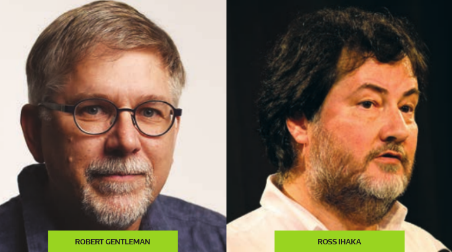

```{r setup, include=FALSE}

knitr::opts_chunk$set(echo = TRUE)

knitr::opts_chunk$set(
  fig.align = "center",
  fig.retina = 2,
  cache = F#, echo=F, warning=F, message=F
  )

# knitr::opts_chunk$set(fig.dim=c(4.8, 4.5), fig.retina=2, out.width="100%")

# install package management tool pacman
# install.packages("pacman")

# devtools::install_github("CorrelAid/datenguideR")

pacman::p_load(
  tidyverse,
  showtext,
  dagitty,
  ggdag,
  data.table,
  patchwork,
  rvest
)


# font_add_google(
#   name = "IBM Plex Sans",
#   family = "plex"
# )

# showtext_auto()


knitr::opts_chunk$set(
  message = FALSE,
  warning = FALSE
)

```


```{r set-ggplot-theme, include=FALSE}

theme_set(theme_classic() +
  theme(
    text = element_text(family = "plex", size = 25, colour="#415564"),
    panel.background = element_rect(fill = "#f6f3f2"), 
    plot.background = element_rect(fill = "#f6f3f2", color = "#f6f3f2"), 
    panel.grid.major = element_line(colour="#e8e8e8"),
    panel.grid.minor = element_blank(), 
    legend.background = element_rect(fill = "#f6f3f2"), 
    legend.box.background = element_rect(fill = "#f6f3f2"), 
    axis.text = element_text(colour="#415564"),
    axis.line = element_line(colour="#415564"),
    axis.title = element_text(colour="#415564"),
    axis.ticks = element_line(colour="#415564"),
  ))

purple <- "#644155"

```


```{r xaringan-scribble, echo=FALSE}
xaringanExtra::use_scribble(pen_color = purple)
```


class: inverse, center, title-slide, middle

<style>
.title-slide .remark-slide-number {
  display: none;
}
</style>

# .title-wrap[Intro to Programming with R for Political Scientists]

<br /> 

## .handw[]

### Markus Freitag

### Geschwister Scholl Institute of Political Science, LMU

### [`r icons::icon_style(icons::fontawesome("twitter"), fill = "#415564")`](https://twitter.com/MarkusGFreitag) [`r icons::icon_style(icons::fontawesome("globe"), fill = "#415564")`](https://markusfreitag.netlify.app/)


### `r Sys.Date()`

<a href="https://github.com/m-freitag" class="github-corner" aria-label="View source on Github"><svg width="80" height="80" viewBox="0 0 250 250" style="fill:#415564; color:#f6f3f2; position: absolute; top: 0; border: 0; right: 0;" aria-hidden="true"><path d="M0,0 L115,115 L130,115 L142,142 L250,250 L250,0 Z"></path><path d="M128.3,109.0 C113.8,99.7 119.0,89.6 119.0,89.6 C122.0,82.7 120.5,78.6 120.5,78.6 C119.2,72.0 123.4,76.3 123.4,76.3 C127.3,80.9 125.5,87.3 125.5,87.3 C122.9,97.6 130.6,101.9 134.4,103.2" fill="currentColor" style="transform-origin: 130px 106px;" class="octo-arm"></path><path d="M115.0,115.0 C114.9,115.1 118.7,116.5 119.8,115.4 L133.7,101.6 C136.9,99.2 139.9,98.4 142.2,98.6 C133.8,88.0 127.5,74.4 143.8,58.0 C148.5,53.4 154.0,51.2 159.7,51.0 C160.3,49.4 163.2,43.6 171.4,40.1 C171.4,40.1 176.1,42.5 178.8,56.2 C183.1,58.6 187.2,61.8 190.9,65.4 C194.5,69.0 197.7,73.2 200.1,77.6 C213.8,80.2 216.3,84.9 216.3,84.9 C212.7,93.1 206.9,96.0 205.4,96.6 C205.1,102.4 203.0,107.8 198.3,112.5 C181.9,128.9 168.3,122.5 157.7,114.1 C157.9,116.9 156.7,120.9 152.7,124.9 L141.0,136.5 C139.8,137.7 141.6,141.9 141.8,141.8 Z" fill="currentColor" class="octo-body"></path></svg></a><style>.github-corner:hover .octo-arm{animation:octocat-wave 560ms ease-in-out}@keyframes octocat-wave{0%,100%{transform:rotate(0)}20%,60%{transform:rotate(-25deg)}40%,80%{transform:rotate(10deg)}}@media (max-width:500px){.github-corner:hover .octo-arm{animation:none}.github-corner .octo-arm{animation:octocat-wave 560ms ease-in-out}}</style>

---
# Overview

1. .hl[Intro]

2. .hl[R-Studio and (Git)Hub]

3. .hl[Base R & Tidyverse Basics]

4. .hl[Data Wrangling I]

5. .hl[Data Wrangling II]

6. .hl[Data Viz]

7. .hl[Writing Functions]

8. .hl[A complete scientific workflow with R]

---

# Trivia

- R was designed in 1993 by Ross Ihaka and Robert Gentleman

- Builds upon the S programming language by John Chambers

    - Named R as a play on S and bc of the first names of the authors

```{r, echo = FALSE, results='hide'}

CRANpackages <- available.packages()
nrow(CRANpackages)

nb_pkgs <- nrow(CRANpackages)
```

- There are `r nb_pkgs` packages available on [CRAN](https://cran.r-project.org/) as of `r Sys.Date()`.

- [R-Studio](https://www.rstudio.com/about/) $\neq$ [R-Core Team](https://www.r-project.org/contributors.html); the former is a mix of a for-profit and a non-profit company; highly committed to produce free & open-source products; has some business solutions

```{r, echo=FALSE, fig.align='center', out.width= "25%"}

```
.center[.font50[[Image source and more R-History trivia](https://rss.onlinelibrary.wiley.com/doi/epdf/10.1111/j.1740-9713.2018.01169.x)]]
---

class: inverse, center, middle
name: intro

# CalculatoR


---

# CalculatoR

```{r}

7+5 # [n] stands for the nth element printed to the console. 

```

```{r}

4*5+2/3^3 # Multiplication and division first, then addition and subtraction

# Modulo Operators:

10 %/% 3 # Integer division

10 %% 3 # Remainder ("Rest")
```

---

# CalculatoR

```{r}
# Relational and logical operators

3 < 4

2 == 1 & 4 > 2  # == "equal to"; & "element wise logical AND"

2 == 1 | 4 > 2 # | "element wise logical or"

3 != 4 # != "not equal"

7 %in% 300:500 # %in% can be used to evaluate matches in objects

# Take care about the order of precedence...

```

---
# CalculatoR

.pull-left[
```{r}

# Floating Points

0.1 + 0.2

0.1 + 0.2 == 0.3

```

Why?!

> [Because internally, computers use a format (binary floating-point) that cannot accurately represent a number like 0.1, 0.2 or 0.3 at all.](https://floating-point-gui.de/basic/)


]

.pull-right[

```{r, echo=FALSE, fig.align='center', out.width= "60%"}

```

] 

---

class: inverse, center, middle
name: intro

# A Primer on OOP ("Object Oriented Programming")

---

# Object Oriented Programming

> Everything is an object and everything has a name.

```{r, echo=FALSE, fig.align='center', out.width= "80%"}

```


---

# Functions


---

# Making Objects: Assignment
.pull-left[
- You can use `<-` or `=` for assignment

- For instance, 
```{r}
a <- 3 # Or a = 3; under the hood, assignment works more like a -> 3
```
assigns the name `x` to an object of type/mode numeric. I.e. binds an object to a name.

Simplification:
> creates an object named `a`, containing the value `3`.
]

.pull-right[
-Using
```{r, results= "hide"}
class(a)
mode(a)
```  
gives you information about the class/type of the object. `class()` gives the 
class of the object from an OOP POV, `typeof()` the base type.  

- In this case, this is not very interesting as we created an **atomic** numeric vector. 
]
---

# Making Objects: Assignment

- Using `=` is legal as per the man, the myth, the legend Ross Ihaka himself:

<center><iframe width="560" height="315" src="https://www.youtube.com/embed/88TftllIjaY?start=2100" title="YouTube video player" frameborder="0" allow="accelerometer; autoplay; clipboard-write; encrypted-media; gyroscope; picture-in-picture" allowfullscreen></iframe></center>


---

# Naming Conventions


---

# Workspace & Environment

- In contrast to Stata, R can hold multiple 


---

# Vectors


---


# Matrices

---

# Lists

---

# Factors


---

# Data Frames


---

# Some Indexing Basics


---

# Loading Packages


---

# The Tidyverse

---

# The Tidyverse


---

# Summary


```{r print pdf, include=FALSE}

  pagedown::chrome_print("./02_Basics.html")

```
 
