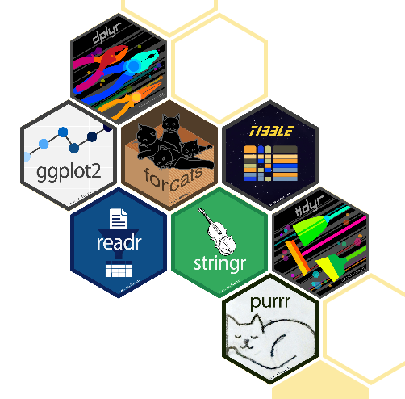
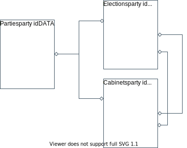

```{r setup, include=FALSE}

knitr::opts_chunk$set(echo = TRUE, cache = FALSE)

knitr::opts_chunk$set(
  fig.align = "center",
  fig.retina = 2,
  cache = F # , echo=F, warning=F, message=F
)

# knitr::opts_chunk$set(fig.dim=c(4.8, 4.5), fig.retina=2, out.width="100%")

# install package management tool pacman
# install.packages("pacman")

# devtools::install_github("CorrelAid/datenguideR")

pacman::p_load(
  tidyverse,
  data.table,
  rio,
  patchwork,
  DT,
  modelsummary,
  collapse
)


# font_add_google(
#   name = "IBM Plex Sans",
#   family = "plex"
# )

# showtext_auto()


knitr::opts_chunk$set(
  message = FALSE,
  warning = FALSE
)
```


```{r set-ggplot-theme, include=FALSE}

theme_set(theme_classic() +
  theme(
    text = element_text(family = "plex", size = 25, colour = "#415564"),
    panel.background = element_rect(fill = "#f6f3f2"),
    plot.background = element_rect(fill = "#f6f3f2", color = "#f6f3f2"),
    panel.grid.major = element_line(colour = "#e8e8e8"),
    panel.grid.minor = element_blank(),
    legend.background = element_rect(fill = "#f6f3f2"),
    legend.box.background = element_rect(fill = "#f6f3f2"),
    axis.text = element_text(colour = "#415564"),
    axis.line = element_line(colour = "#415564"),
    axis.title = element_text(colour = "#415564"),
    axis.ticks = element_line(colour = "#415564"),
  ))

purple <- "#644155"

```


```{r xaringan-scribble, echo=FALSE}
xaringanExtra::use_scribble(pen_color = purple)
```


class: inverse, center, title-slide, middle

<style> .title-slide .remark-slide-number {
  display: none;
} </style>

# .title-wrap[Intro to Programming with R for Political Scientists]

<br />

## .header-fancy[Session 3: Data Wrangling]

### Markus Freitag

### Geschwister Scholl Institute of Political Science, LMU

### [`r icons::icon_style(icons::fontawesome("twitter"), fill = "#415564")`](https://twitter.com/MarkusGFreitag) [`r icons::icon_style(icons::fontawesome("globe"), fill = "#415564")`](https://markusfreitag.netlify.app/)


### `r Sys.Date()`

<a href="https://github.com/m-freitag" class="github-corner" aria-label="View
source on Github"><svg width="80" height="80" viewBox="0 0 250 250"
style="fill:#415564; color:#f6f3f2; position: absolute; top: 0; border: 0;
right: 0;" aria-hidden="true"><path d="M0,0 L115,115 L130,115 L142,142 L250,250
L250,0 Z"></path><path d="M128.3,109.0 C113.8,99.7 119.0,89.6 119.0,89.6
C122.0,82.7 120.5,78.6 120.5,78.6 C119.2,72.0 123.4,76.3 123.4,76.3 C127.3,80.9
125.5,87.3 125.5,87.3 C122.9,97.6 130.6,101.9 134.4,103.2" fill="currentColor"
style="transform-origin: 130px 106px;" class="octo-arm"></path><path
d="M115.0,115.0 C114.9,115.1 118.7,116.5 119.8,115.4 L133.7,101.6 C136.9,99.2
139.9,98.4 142.2,98.6 C133.8,88.0 127.5,74.4 143.8,58.0 C148.5,53.4 154.0,51.2
159.7,51.0 C160.3,49.4 163.2,43.6 171.4,40.1 C171.4,40.1 176.1,42.5 178.8,56.2
C183.1,58.6 187.2,61.8 190.9,65.4 C194.5,69.0 197.7,73.2 200.1,77.6 C213.8,80.2
216.3,84.9 216.3,84.9 C212.7,93.1 206.9,96.0 205.4,96.6 C205.1,102.4
203.0,107.8 198.3,112.5 C181.9,128.9 168.3,122.5 157.7,114.1 C157.9,116.9
156.7,120.9 152.7,124.9 L141.0,136.5 C139.8,137.7 141.6,141.9 141.8,141.8 Z"
fill="currentColor"
class="octo-body"></path></svg></a><style>.github-corner:hover
.octo-arm{animation:octocat-wave 560ms ease-in-out}@keyframes
octocat-wave{0%,100%{transform:rotate(0)}20%,60%{transform:rotate(-25deg)}40%,80%{transform:rotate(10deg)}}@media
(max-width:500px){.github-corner:hover .octo-arm{animation:none}.github-corner
.octo-arm{animation:octocat-wave 560ms ease-in-out}}</style>

---

# Overview

1. Intro

2. R-Studio and (Git)Hub

3. Base R & Tidyverse Basics

4. .hl[Data Wrangling]

5. Data Viz

6. Writing Functions

7. A complete scientific workflow with R


---

# Workflow

- Navigate to `Session Scripts > Session 3` and open `Session_3_script.R`.

- You will see a pre-formatted Script.

- The script is otherwise empty. Fill it with the stuff I will discuss on the slides.

- Make comments for yourself. Learn as you write. Explore. Stage, commit and push.

- Hopefully not you &rightarrow; 

- If you have a second monitor, great! If not, split your screen.

---

# Tidyverse Packages

```{r, echo=FALSE, fig.align='center', out.width= "45%"}

```

- These are only the tidyverse packages loaded by default. There are 
[more](https://tidyverse.tidyverse.org/) (e.g. [lubridate](https://github.com/tidyverse/lubridate)).

---

# The Philosophy: Tidy Data

> 1. Each variable forms a column.
> 2. Each observation forms a row.
> 3. Each type of observational unit forms a table. [(Wickham 2014)](https://www.jstatsoft.org/index.php/jss/article/view/v059i10/v59i10.pdf)

- Sounds pretty reasonable. 3. is related to constructing clean relational data 
bases (we will see an example later).

- However, we can relax this from time to time given our needs/statistical methods.

.hl2[Messy data] is everything else, e.g.:

.code60[
```{r, echo = FALSE}

lotr <- data.frame(
  race = c("hobbits", "hobbits", "elves", "hobbits", "dwarves", "men"),
  character = c("Frodo", "Sam", "Arwen", "Golum", "Gimli", "Eowyn"),
  gender = c("male", "male", "female", "male", "male", "female"),
  `age_0-100` = c(1,1,0,0,0,1),
  `age_100-500` = c(0,0,0,0,1,0),
  `age_500-100` = c(0,0,0,1,0,0),
  `age_>1000` = c(0, 0, 1, 0, 0, 0), 
  check.names = FALSE
)
lotr

```
]
---
# The Philosophy: Tidy Data

Tidy:

```{r, echo = FALSE}

lotr <- lotr %>%
  pivot_longer(4:7, names_to = "age_cat", values_to = "classifier") %>%
  filter(classifier == 1) %>%
  select(-classifier) %>%
  mutate(age_cat = str_remove(age_cat, "age_"))

as.data.frame(lotr)

```

---

# Tibbles

- Tibbles are data.frames but with some perks. For instance, subset more strictly.

- They also print differently (better):

```{r}
as_tibble(lotr) # You don't have the data here.
# Hint: You can create one just like data frames but with tibble().
```

---

# Importing/Exporting Data

- R comes with it's own two file formats, `.rds` (single objects) and `.rda` (multiple
    objects/tabular data).

- However, for saving the latter you will (and should) use `.csv` or `.json` (human readable) most of the time.

- For R novices, importing and exporting can be a bit of a pain.

    - There are different functions/packages for reading different file formats (haven, data.table, readxl etc.).

- Thankfully, the [rio](https://github.com/leeper/rio) package by Thomas Leeper and Chung-hong Chan et al. makes our life easier.

- Provides `export()` and `import` as wrappers fot the above mentioned packages.

```{r, eval = FALSE}
install.packages("rio")
``` 

---

# Importing/Exporting Data

```{r, eval = FALSE, resu}
library(rio)
# Export
export(mtcars, "mtcars.csv") # R's built-in mtcars data-set.
export(mtcars, "mtcars.rds") # R serialized
export(mtcars, "mtcars.dta") # Stata
export(mtcars, "mtcars.json")

# Import
W <- import("mtcars.csv")
X <- import("mtcars.rds")
Y <- import("mtcars.dta")
Z <- import("mtcars.json")

```
---

# Importing/Exporting Data

.code70[
```{r}
# Exporting/importing several data frames: export_list()/import_list()

# Make a list of two built-in data sets.
# tibble::lst() automatically names the elements:
df_list <- tibble::lst(mtcars, iris)

export_list(df_list, file = paste0(names(df_list), ".csv"))
# export_file takes a character vector; hence, we build one from the names of our element
# With the paste0() we paste ".csv" to every element of the character vector
# produced by names(df_list).

Z <- import_list(dir(pattern = "csv$"))
# import_file takes achr vector holding file paths/files.
# With dir() we get all names of the files that match a specific pattern (regular expression). 
# In this case, all files that end with csv ($ matches the end of the string).[1]
```
]

.font70[<sup>[1]</sup> .hl[Fine Point:] [Regular expressions](https://en.wikipedia.org/wiki/Regular_expression) were developed in computer
science to specify search patterns/make character matching possible. They are very useful (e.g. for manipulating/cleaning textual data) but pretty hard to memorize. Even if you know the basics, you will google alot.
In R, I recommend the [stringi/stringr](https://cran.r-project.org/web/packages/stringr/vignettes/regular-expressions.html) packages.]

---

#  Pipes: %>% and |>

- Pipes are crucial to the tidyverse workflow but also in general.

- They make code more readable.

Idea: Take the output of a function and to pass it **as the 
first argument** of another function.

$$f(g(x)) \quad \text{becomes (in R)} \quad x  \quad \text^{[1]} \quad g() \quad 
\text \quad f()$$

--

.code80[
```{r, eval = FALSE}
x <- c(1, 2, 3, 4)

sqrt(mean(x))

x %>%
  mean() %>%
  sqrt()

```
]

<sub>.font70[[1]]<sub/> .hl[TIPP:] Press ctrl-shift-m to produce the [magrittr](https://magrittr.tidyverse.org/) 
pipe, `%>%`, in RStudio.

---

# Pipes: %>% and |>

- We can also pass the output as the second, third, ... argument using `.` as a 
placeholder.

- `f(a, b = c)` can be written as `c %>% f(a, b = .)`

Example:

```{r}
"Ceci n&#37;est pas une pipe" %>% gsub("&#37;", "'", .) # gsub() performs replacement of all matches in a chr. vector.
```
--

- They are so useful, the R core team even introduced a base pipe (`|>`), in May 2021.
Something like this happen **very** rarely: 

```{r, eval = FALSE}
x |>
  mean() |>
  sqrt()
```
---

# Pipes: %>% and |>

- The base pipe is a [tiny](https://statistik-dresden.de/archives/17227) bit faster.

- Does not need an extra dependency. Useful for package development (using the 
magrittr pipe in packages can be annoying sometimes).

--

- .hl[BUT]: it does not (yet) properly support the `.` placeholder (as of June 2021).

We can hack it tho:
```{r}
Sys.setenv("_R_USE_PIPEBIND_" = "true")
"Ceci n&#37;est pas une pipe" |> . => gsub("&#37;", "'", .)
```

- That's pretty ugly and [apparently](https://twitter.com/rdataberlin/status/1396170545046097928) 
still buggy. We will stick to  `%>%`.

---

class: inverse, center, middle name: intro

# Let's Wrangle      

---

# The Data

- We will use the [parlgov](http://www.parlgov.org/) database:

> ParlGov is a data infrastructure for political 
science and contains information for all EU 
and most OECD democracies (37 countries). 
The database combines approximately 1700 
parties, 1000 elections (9400 results), and 1600 cabinets (3900 parties).

- It's relational, i.e. consists of different tables (parties, elections, cabinets)
that can be **joined** using key variables.

---

# The Data

```{r, echo=FALSE, fig.align='center', out.width= "60%"}

```

---

# The Data

- We will use the [parlgov](http://www.parlgov.org/) database:

> ParlGov is a data infrastructure for political 
science and contains information for all EU 
and most OECD democracies (37 countries). 
The database combines approximately 1700 
parties, 1000 elections (9400 results), and 1600 cabinets (3900 parties).

- It's relational, i.e. consists of different tables (parties, elections, cabinets)
that can be **joined** using key variables.

- It makes for pretty simple and intuitive examples.

Let's import the election data:

```{r}
parlgov_elec <- import("http://www.parlgov.org/static/data/development-cp1252/view_election.csv")
```

---

# The Data: Getting an Overview

.code70[
```{r}
glimpse(parlgov_elec) # enhanced version of str()
```
]

---
  
# The Data: Getting an Overview


```{r, echo = FALSE}

datatable(head(parlgov_elec, 10),
  width = "100%",
  options = list(pageLength = 3, scrollX = TRUE)
)
```

.hl[Q]: Is this data set tidy?

---

# The Data: Getting an Overview

.code70[
```{r, eval = FALSE}
datasummary_skim(parlgov_elec) # from modelsummary package. Set type = "categorical" for character vars.

# Of course, not super informative in our hierarchical data set:
```
```{r, echo = FALSE}
datasummary_skim(parlgov_elec) %>% kableExtra::kable_styling(font_size = 17)
```

]

.font70[.hl[TIPP:] The [collapse](https://github.com/SebKrantz/collapse) package 
also provides some data summary functions (`descr()` and `qsu()`) that work really
well on huge data sets. Stata users will love it as its similar to summarize.]


---

# Tidyverse's Wrangling "Wunderkind": dplyr


```{r, echo=FALSE, fig.align='center', out.width= "40%"}
knitr::include_graphics("https://github.com/allisonhorst/stats-illustrations/raw/master/rstats-artwork/dplyr_wrangling.png")
```
<center> .font70[&copy; [Alison Horst](https://github.com/allisonhorst/stats-illustrations)] <center/>

A full list of `dplyr` functions can be found [here](https://dplyr.tidyverse.org/reference/index.html).

---

# Data Masking

- Before we jump right in, remember when we talked about R environments in the last
session?

- When we wanted to pass a variable of a data frame (or element of a list) 
to a function, we needed to make that .hl[explicit], e.g., using `$` for subsetting.

```{r, eval = FALSE}
lm(df$y ~ df$x)
```

- Some important dplyr functions use [data masking](https://dplyr.tidyverse.org/articles/programming.html)
such that you can refer to variables just like objects in the (global) envornment.

- Get's rid of .hl[$]s. 

---

# Filtering Rows

- Let's start with something very basic: filtering rows.

- For instance, we might want to obtain only the results of all Bundestag elections:

```{r}
parlgov_elec_de <- parlgov_elec %>% # add, e.g., _de if we want to keep our original df 
  filter(country_name_short == "DEU")
```

- Now, say we want the mean SPD vote share across all elections:

```{r, eval = FALSE}
parlgov_elec_de %>% # add, e.g., _de if we want to keep our original df 
  filter(party_name_short == "SPD") %>% 
  mean(vote_share)
```

- That does not work....hl[Q]: Why?

---

# summarise() and pull()

- Base-R's summary stats functions can't take a df or tibble and we did not wrap it into 
a dplyr function (.hl[in order for data masking to kick in]).

Two options:

.pull-left[

1. We can use `pull()` to pull out a vector form a df; works like `$` but for pipes.

```{r}

parlgov_elec_de %>% # add, e.g., _de if we want to keep our original df
  filter(party_name_short == "SPD") %>%
  pull(vote_share) %>% 
  mean()

```
]

.pull-right[
2. We can wrap `mean()`into `summarise()` ("data-masking" for built-in summary functions):

```{r}
parlgov_elec_de %>%
  filter(party_name_short == "SPD") %>%
  summarise(mean(vote_share)) # summarise() takes summary functions such as mean(), sd(), etc.
```
]

---

# summarise()

- Puts out a tibble we can pass to other dplyr functions.
    
- We can also compute more summary statistics with `summarise()` .hl[AND] also turn
them into variables

```{r}
parlgov_elec_de %>%
  filter(party_name_short == "SPD") %>%
  summarise(mean = mean(vote_share), sd = sd(vote_share))

```

- In that, it is somewhat similar to the `mutate` command...

---
  
# mutate()

- With `mutate()` you can add columns - or overwrite existing ones 
(with the same name) - based on transformations of other variables

- For instance, say we want to add a new column "seat_share":

```{r}

parlgov_elec_de <- parlgov_elec_de %>% # here, we "overwrite" our df
  mutate(seat_share = seats/seats_total) 

parlgov_elec_de %>% filter(election_date >= "2017")

datasummary_skim(parlgov_elec_de$seat_share) # quick check

```


```{r print pdf, include=FALSE}
# pagedown::chrome_print("./02_Data_Wrangling.html")
```

```{r xaringanExtra-share-again, echo=FALSE}
# xaringanExtra::use_share_again()
```