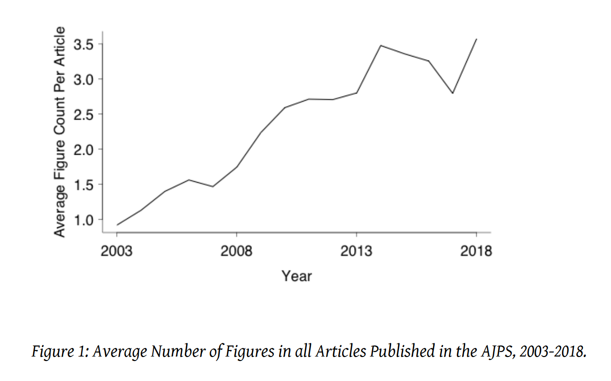
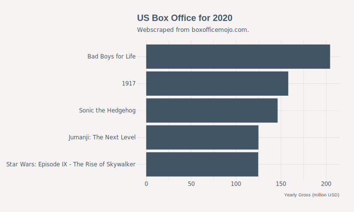
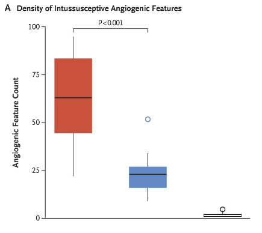
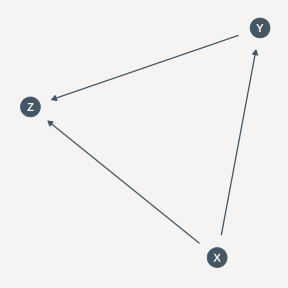
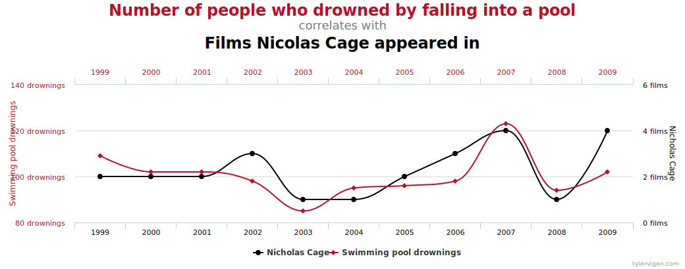
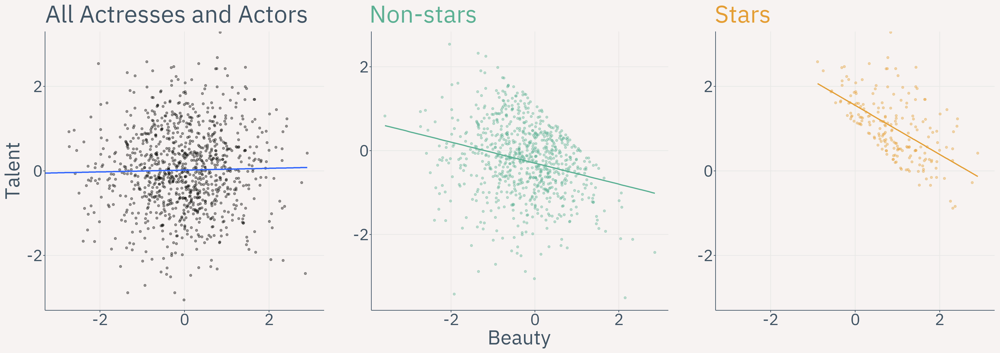
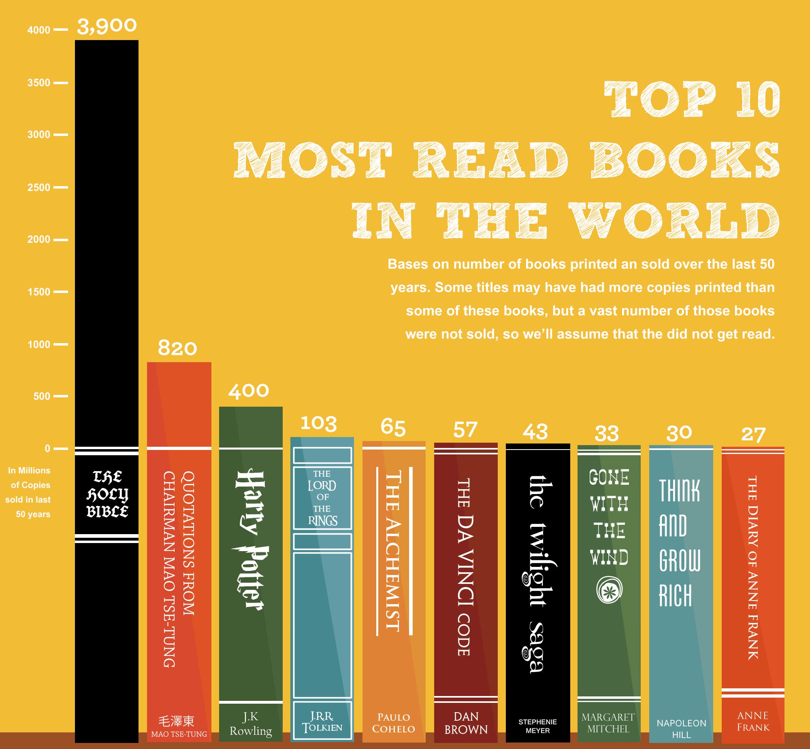
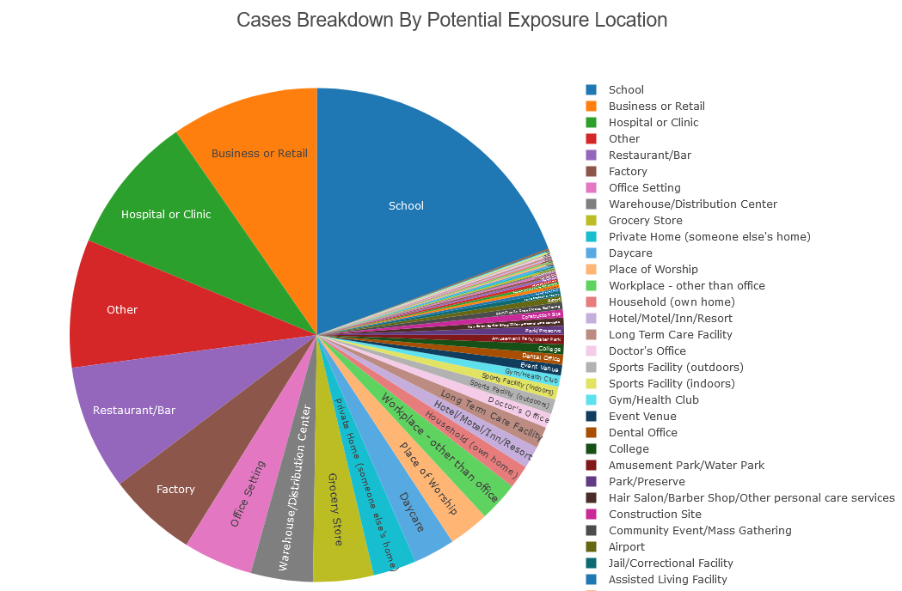
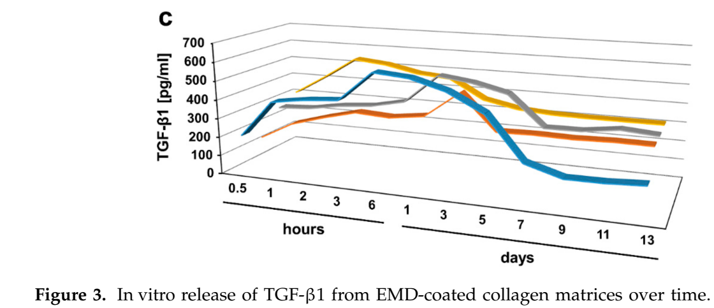
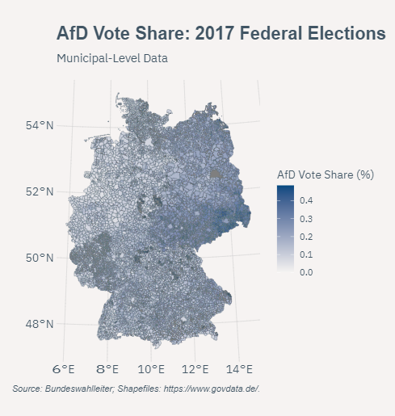

```{r setup, include=FALSE}

knitr::opts_chunk$set(echo = TRUE)

knitr::opts_chunk$set(
  fig.align = "center",
  fig.retina = 2,
  cache = FALSE # , echo=F, warning=F, message=F
)

# knitr::opts_chunk$set(fig.dim=c(4.8, 4.5), fig.retina=2, out.width="100%")

# install package management tool pacman
# install.packages("pacman")

# devtools::install_github("CorrelAid/datenguideR")

pacman::p_load(
  tidyverse,
  data.table,
  rio,
  patchwork,
  DT,
  modelsummary,
  collapse,
  forcats,
  patchwork,
  bayesplot,
  rstanarm,
  brms,
  dabestr,
  rvest,
  xml2,
  dagitty,
  ggdag,
  showtext,
  sensemakr,
  hrbrthemes,
  extrafont,
  RColorBrewer,
  palmerpenguins,
  gghalves,
  ggdist
)

# font_add_google(
#   name = "IBM Plex Sans",
#   family = "plex"
# )

# showtext_auto()

knitr::opts_chunk$set(
  message = FALSE,
  warning = FALSE
)

```


```{r set-ggplot-theme, include=FALSE}

extrafont::loadfonts()

plex <- theme_ipsum() +
  theme(
    text = element_text(colour = "#415564", family = "IBM Plex Sans"),
    plot.title = element_text(colour = "#415564", family = "IBM Plex Sans"),
    plot.subtitle = element_text(colour = "#415564", family = "IBM Plex Sans"),
    plot.background = element_rect(fill = "#f6f3f2", color = "#f6f3f2"),
    panel.border = element_blank(),
    strip.text = element_text(colour = "#415564"),
    axis.text = element_text(colour = "#415564"),
    axis.title = element_text(colour = "#415564")
  )

theme_set(plex)


purple <- "#644155"

```


```{r xaringan-scribble, echo=FALSE}
xaringanExtra::use_scribble(pen_color = purple)
```


class: inverse, center, title-slide, middle

<style> .title-slide .remark-slide-number {
  display: none;
} </style>

# .title-wrap[Intro to Programming with R for Political Scientists]

<br />

## .header-fancy[Session 4: Data Visualization]

### Markus Freitag

### Geschwister Scholl Institute of Political Science, LMU

### [`r icons::icon_style(icons::fontawesome("twitter"), fill = "#415564")`](https://twitter.com/MarkusGFreitag) [`r icons::icon_style(icons::fontawesome("globe"), fill = "#415564")`](https://markusfreitag.netlify.app/)


### 19.07.2021

<a href="https://github.com/m-freitag" class="github-corner" aria-label="View
source on Github"><svg width="80" height="80" viewBox="0 0 250 250"
style="fill:#415564; color:#f6f3f2; position: absolute; top: 0; border: 0;
right: 0;" aria-hidden="true"><path d="M0,0 L115,115 L130,115 L142,142 L250,250
L250,0 Z"></path><path d="M128.3,109.0 C113.8,99.7 119.0,89.6 119.0,89.6
C122.0,82.7 120.5,78.6 120.5,78.6 C119.2,72.0 123.4,76.3 123.4,76.3 C127.3,80.9
125.5,87.3 125.5,87.3 C122.9,97.6 130.6,101.9 134.4,103.2" fill="currentColor"
style="transform-origin: 130px 106px;" class="octo-arm"></path><path
d="M115.0,115.0 C114.9,115.1 118.7,116.5 119.8,115.4 L133.7,101.6 C136.9,99.2
139.9,98.4 142.2,98.6 C133.8,88.0 127.5,74.4 143.8,58.0 C148.5,53.4 154.0,51.2
159.7,51.0 C160.3,49.4 163.2,43.6 171.4,40.1 C171.4,40.1 176.1,42.5 178.8,56.2
C183.1,58.6 187.2,61.8 190.9,65.4 C194.5,69.0 197.7,73.2 200.1,77.6 C213.8,80.2
216.3,84.9 216.3,84.9 C212.7,93.1 206.9,96.0 205.4,96.6 C205.1,102.4
203.0,107.8 198.3,112.5 C181.9,128.9 168.3,122.5 157.7,114.1 C157.9,116.9
156.7,120.9 152.7,124.9 L141.0,136.5 C139.8,137.7 141.6,141.9 141.8,141.8 Z"
fill="currentColor"
class="octo-body"></path></svg></a><style>.github-corner:hover
.octo-arm{animation:octocat-wave 560ms ease-in-out}@keyframes
octocat-wave{0%,100%{transform:rotate(0)}20%,60%{transform:rotate(-25deg)}40%,80%{transform:rotate(10deg)}}@media
(max-width:500px){.github-corner:hover .octo-arm{animation:none}.github-corner
.octo-arm{animation:octocat-wave 560ms ease-in-out}}</style>

---

# Overview

1. Intro

2. R-Studio and (Git)Hub

3. Base R & Tidyverse Basics

4. Data Wrangling

5. .hl[Data Viz]

6. Writing Functions

7. A complete scientific workflow with R


---

# Workflow

- Navigate to `Session Scripts > Session 4` and open `Session_4_script.R`.

- You will see a pre-formatted Script with all the steps I do on the slides.

- Explore as you follow. 

- If you have a second monitor, great! If not, split your screen.


---

class: inverse, center, middle name: intro


# Why is data viz important?


---

# Why is data viz important?

- We have always tried to represent information in an (abstract) visual form...

```{r, echo = FALSE, out.width = "30%"}

knitr::include_graphics("https://upload.wikimedia.org/wikipedia/commons/thumb/9/9e/Babylonian_Map_of_the_World%2C_700-500_BC.jpg/800px-Babylonian_Map_of_the_World%2C_700-500_BC.jpg")

```

[The Babylonian Map of the World.](https://en.wikipedia.org/wiki/Babylonian_Map_of_the_World) Oldest known world map.

---

# Why is data viz important?


.hl[Communication]

- Useful for...
    - exploring data structure/cleaning data (e.g. spotting missing or outliers)
    - identifying trends, clusters, descriptive patterns
    - descriptive as well as for statistical and causal inference 

.hl2[BUT:] Visual Inferences can also mis-guide in several ways (for one perspective on this, 
see e.g. [here](https://www.richardtraunmueller.com/wp-content/uploads/2019/01/Traunmueller-Visual-Inference-CCCP.pdf)).

- More generally, graphical abstractions can aid in other aspects when working with data (e.g. graphical representations of database structures or DAGs as a tool to see conditions for causal identification more easily).


---

# Why is data viz important?


```{r, echo = FALSE}



```
Source: [Traunmueller, 2018](https://www.richardtraunmueller.com/wp-content/uploads/2019/01/Traunmueller-Visual-Inference-CCCP.pdf).

---

# Useful for Description...

- We observe (see) some data and have various ways to transport summarising information
to our eyes, e.g.:

```{r, echo = FALSE, out.width = "70%"}

base_url <- "https://www.boxofficemojo.com/year/2020/?ref_=bo_yl_table_2"

base_webpage <- read_html(base_url)

table_base <- rvest::html_table(base_webpage)[[1]] %>%
  tibble::as_tibble(.name_repair = "unique")

table_base$Gross <- as.numeric(gsub("[$,]", "", table_base$Gross))
table_base$Gross <- table_base$Gross/1000000


p <- table_base %>%
  filter(Rank <= 5) %>%
  ggplot(aes(x = Gross, y = Release)) +
  geom_col(fill = "#415564") +
  geom_hline(yintercept = 0) +
  aes(y = reorder(Release, Gross)) +
  labs(
    x = "\n Yearly Gross (million USD)",
    y = "",
    title = "US Box Office for 2020",
    subtitle = "Webscraped from boxofficemojo.com."
  ) 
ggsave(plot = p, "Figs/box.svg", width = 10, height = 6)



```

---

# Useful for Statistical Inference...

.font80[
- Inferring the unkown (some population quantity/parameter, e.g. $E[Y|X]$) from the known (the data at hand). 

- Does what we see in the data accurately represent what we would see in the population we are interested in? How certain are we? 

- Visualization is important to express our uncertainty about parameters...
]
```{r, echo = FALSE, results = "hide"}

fit <- stan_glm(mpg ~ ., data = mtcars)
posterior <- as.matrix(fit)


```

```{r, echo = FALSE, out.width = "30%"}
mcmc_areas(posterior,
  pars = c("cyl", "drat", "am", "wt"),
  prob = 0.89
) + theme(text = element_text(size = 20)) +
  ggtitle("Posterior distributions", subtitle = "with medians and 89% intervals")
```


---

# Useful for Statistical Inferences...

.pull-left[

Not optimal ([NJEM 2020, Comparing Covid and Influenza Lungs](https://www.nejm.org/doi/full/10.1056/nejmoa2015432)):

```{r, echo = FALSE, out.width = "70%"}



```

]


.pull-right[

A little [better](https://www.estimationstats.com/#/background) (not the same data, just a sim. example):
```{r, echo = FALSE, out.width = "80%"}

# Taken from this vignette: https://cran.r-project.org/web/packages/dabestr/vignettes/using-dabestr.html

set.seed(54321)

N <- 40
c1 <- rnorm(N, mean = 100, sd = 25)
c2 <- rnorm(N, mean = 100, sd = 50)
g1 <- rnorm(N, mean = 120, sd = 25)
g2 <- rnorm(N, mean = 80, sd = 50)
g3 <- rnorm(N, mean = 100, sd = 12)
g4 <- rnorm(N, mean = 100, sd = 50)
gender <- c(rep("Male", N / 2), rep("Female", N / 2))
dummy <- rep("Dummy", N)
id <- 1:N

wide.data <-
  tibble::tibble(
    Control1 = c1, Control2 = c2,
    Group1 = g1, Group2 = g2, Group3 = g3, Group4 = g4,
    Dummy = dummy,
    Gender = gender, ID = id
  )


my.data <-
  wide.data %>%
  tidyr::gather(key = Group, value = Measurement, -ID, -Gender, -Dummy)

two.group.unpaired <-
  my.data %>%
  dabest(Group, Measurement,
    idx = c("Control1", "Group1"),
    paired = FALSE
  )
two.group.unpaired.meandiff <- mean_diff(two.group.unpaired)

plot(two.group.unpaired.meandiff)

```

]


---

# Visualizations are also useful for Causal Inference...

- We can represent our theoretical knowledge about (the absense) of causal 
relationships between with  graphical models:

```{r dag, echo=FALSE, fig.cap = "A DAG."}

p <- dagitty("dag {
  X -> {Z Y}
  Y -> Z
               }"
) %>% 
tidy_dagitty() %>% 
ggplot(aes(x = x, y = y, xend = xend, yend = yend)) +
      geom_dag_point(col = "#425664", size = 9) +
      geom_dag_edges(edge_colour = "#425664") +
      geom_dag_text(col = "#f6f4f2") +
      theme_dag(base_size = 10, 
                    base_family = "plex", 
                    plot.background = element_rect(fill = "#f6f4f2", 
                                                   color = NA)
                    )
ggsave(plot = p, "Figs/dag.svg", width = 4, height = 4)



```

---
  
# Visualizations are also useful for Causal Inference...

Or for sensitivity analysis:

```{r, echo = FALSE}
data("darfur")

# runs regression model
model <- lm(peacefactor ~ directlyharmed + age + farmer_dar + herder_dar +
  pastvoted + hhsize_darfur + female + village, data = darfur)

# runs sensemakr for sensitivity analysis
sensitivity <- sensemakr(
  model = model,
  treatment = "directlyharmed",
  benchmark_covariates = "female",
  kd = 1:3
)

plot(sensitivity)

```

---

# But beware...

- If you conduct exploratory data analysis and plot relationships, e.g. in a scatter plot:

- What you see in the data does not tell you anything about causation. You need theory and assumptions. 
  
- $E[Y|X]$ $\neq$ $E[Y|do(X=x')]$ (correlation is not causation!)

```{r, echo = FALSE, out.width = "75%"}



```

---

# But beware...

```{r, echo = FALSE}
set.seed(66)

# Population
N <- 1000

talent <- rnorm(N)
beauty <- rnorm(N)

df <- data.frame(talent, beauty)

df <- df %>%
  mutate(hard = talent + beauty) %>%
  mutate(star = ifelse(hard > quantile(hard, 0.80), 1, 0))

p1 <- df %>%
  filter(star == 1) %>%
  ggplot(., aes(beauty, talent)) +
  geom_point(color = "#e59e34", alpha = .4) +
  geom_smooth(method = "lm", aes(x = beauty, y = talent), color = "#e59e34", se = FALSE)


p2 <- df %>%
  filter(star == 0) %>%
  ggplot(., aes(beauty, talent)) +
  geom_point(color = "#5cb194", alpha = .4) +
  geom_smooth(method = "lm", aes(x = beauty, y = talent), color = "#5cb194", se = FALSE)


p3 <- df %>% ggplot(., aes(beauty, talent)) +
  geom_point(alpha = .4) +
  geom_smooth(method = "lm", aes(x = beauty, y = talent), se = FALSE)


patch <- p3 + labs(x = "", y = "Talent", title = "All Actresses and Actors") +
  coord_fixed(ratio = 1, xlim = c(-3, 3), ylim = c(-3, 3)) + 
  theme(text = element_text(family = "plex", size = 90, colour = "#415564")) + p2 + coord_fixed() +
  labs(x = "Beauty", y = "", title = "Non-stars") +
  theme(plot.title = element_text(colour = "#5cb194"), text = element_text(family = "plex", size = 90, colour = "#415564")) + p1 +
  labs(x = "", y = "", title = "Stars") +
  theme(plot.title = element_text(colour = "#e59e34"), text = element_text(family = "plex", size = 90, colour = "#415564")) +
  coord_fixed(ratio = 1, xlim = c(-3, 3), ylim = c(-3, 3))

ggsave(plot = patch, "Figs/patch.png", width = 20, height = 10)



```

- Conditioning on the collider „Star“ (filtering our data and looking at subsamples of the „star“ variable)
would lead us to wrongly infer a negative relationship between talent and beauty, even if there is, in fact,
no relationship.


---

# .font70[Still, theory + data + viz can put you on the right tracks...]

John Snow and Cholera in London:

- In the 1840s and 50s, most scientists thought Cholera was transmitted via air.

- John Snow did not and forensically identified contaminated water as the cause of infection.

- During the pandemic, a water company moved their production up the Thames, resulting in a [natural 
experiment (diff-in-diff)](https://www.semanticscholar.org/paper/Causality-in-the-Time-of-Cholera%3A-John-Snow-As-a-Coleman/eec8864302732a862e614789767bb0edc068a2fe).

- He also visualized that Cholera deaths were concentrated around a contaminated pump (from another company).


---

# .font70[Still, theory + data + viz can put you on the right tracks...]

```{r, echo = FALSE, out.width = "45%"}
knitr::include_graphics("Figs/cholera.jpg")
```


Some people still did not believe him. E.g. [Max Pettenkofer](https://de.wikipedia.org/wiki/Max_von_Pettenkofer) in Munich...

---

# Some Principles of Data Viz

- Raw data first. Erase everything unnecessary.

The principle of proportional ink (PPI):

> The representation of numbers, as physically measured on the surface of the 
graphic itself, should be directly proportional to the numerical quantities represented. ([Tufte, 1983](https://www.edwardtufte.com/tufte/books_vdqi))

- Use color (incl. brightness, hue, saturation, etc.), but use it wise.

- Most tables should be figures (except for the case when there is little data)


---

# Some Principles of Data Viz

.hl[Ex.] of PPI violation: not showing 0 in bar plots or other weird things...

```{r, echo = FALSE, out.width = "45%"}

```

---

# Gestalt Principles

- [Gestalt psychology](https://en.wikipedia.org/wiki/Gestalt_psychology) is a somewhat antiquated school of perceptual theory

- However, some of the "laws"/cognitive principles are pretty uncontroversial for [figure](https://www.researchgate.net/profile/Susan-Vanderplas/publication/338386060_Testing_Statistical_Charts_What_Makes_a_Good_Graph/links/600597e645851553a0522eef/Testing-Statistical-Charts-What-Makes-a-Good-Graph.pdf) 
or webdesign:

    - Proximity: Objects or shapes that are spatially close appear to be related.
    - Similarity: Humans group things that look alike (e.g. use of color in figures). 
    - Change Blindness: We have a hard time comparing multiple visually similar plots or 
    facets of plots.
    - Common region: Things in a common region are related, easy to grasp (e.g. confidence intervals)
    

---

# Some No-Noes

Pie charts. Almost always bad (except for maybe dist. of seats in a parlianment with <= 4 parties). 


```{r, echo = FALSE, out.width = "50%"}

```

Source: [https://www.dph.illinois.gov/covid19/location-exposure?regionID=0](https://www.dph.illinois.gov/covid19/location-exposure?regionID=0).

---
  
# Some No-Noes

3D when there is no third dimensions. Also, avoid 3D charts in general and break them down into multiple 2D charts.

```{r, echo = FALSE, out.width = "70%"}

```

---
  
# Some No-Noes

```{r, echo = FALSE, out.width = "30%"}
knitr::include_graphics("Figs/heatmap.png")
```

Source: [https://xkcd.com/1138/](https://xkcd.com/1138/).

---

# From Data to the Eye

[Grammar of Graphics](https://www.springer.com/de/book/9780387245447):

- Data can come in many types: num. continious, num. discrete, categorical (ordered/unordered),
time/date, text, spatial.

- In order to make a Figure, we need to map the data onto components of 
graphical elements: onto .hl2[aesthetics] that form geometric geometric objects.

  > Some aesthetics are: coordinate positions, shapes, colors, line widths, etc.

We need program which cells of our data correspond to which aesthetics values. I.e.
specify a .hl[scale] that connects those two "layers". 


---

# Which Plot to Choose?

- Depends, ofc., on your data (make sure you know it well) and the question you want to answer.

- We will not go through types of charts systematically.

- Take a look at [this](https://clauswilke.com/dataviz/index.html) book and this nice [descision tree](https://www.data-to-viz.com/)
with code examples!

.font70[.hl[Some Tipps:] [Cleveland dot plots](https://edav.info/cleveland.html) are an often useful alternative to bar charts. 
Line graphs need an ordered variable on the x axis. Scatter plots need cont. y 
and x and can be hard to read with big data. For a single numeric or numeric x categorical variables
I like [raincloud plots](https://github.com/RainCloudPlots/RainCloudPlots).]

Workflow:

> Theory/understanding of the data &rightarrow; think about appropriate 
aesthetics and tyes of geometric objects (i.e. plot type) &rightarrow; sketch it by hand! &rightarrow; compute it &rightarrow; detail last!!


---

class: inverse, center, middle name: intro


# Data Viz with ggplot

---
  
# ggplot's Grammar

.pull-left[

- `ggplot` [builds on](https://vita.had.co.nz/papers/layered-grammar.pdf) the grammar of graphics.

- `ggplot(data = df, mapping = aes(x = x, y = y, color = group))` is the core function where
we specify the aesthetic mapping.

- We then add layers with `+`.

]


.pull-right[


```{r, echo = FALSE, out.width = "75%"}
knitr::include_graphics("Figs/layers.png")
```

]

---
  
# A Plot from Scratch 

We will use the UN voting data again, but this time the ideal point estimates of 
[Bailey et al. 2017](https://d1wqtxts1xzle7.cloudfront.net/53137356/jcrpiece.pdf?1494871088=&response-content-disposition=inline%3B+filename%3DEstimating_Dynamic_State_Preferences_fro.pdf&Expires=1625062433&Signature=LCQ0Ad4kSlgDCF6HRlj0oElIcpXyEBtQRg9v7Fsm6wAPHbMTITurc35WYkVvVHunXLCd3uIafxYqPmt8RmsYumGg-zVrAwuMqDsaiO5YaVksmiu0NOabR7seJv92NFA2qTcVEtoy7X4zUmOOvJhTe-DjfgQ8PFNz-MEaVacIMPNAAMl0iRVXVJJR0B4Ks-r0zr75UlYXYhQUvvEnku3xXkhjUtcvWUmZBUEWiRnfgidZaKXXytHmnbNx4MBK-HRKw-Rj7hsis8j4ahIIxSF-YcFzH6CPrdtvIlS5c-Pt6HP3zu-9lM0dC7KqV5A6T6OHxHNWr3voCnoch8pYdOxdZQ__&Key-Pair-Id=APKAJLOHF5GGSLRBV4ZA).

  - Based on an IRT, they compute session-year ideal points that can also be used to compute
  dyadic similarity measures. 

  - We will replicate and extend one of their time series figures to the post 2010 period.

Preprocessing:
.code60[
```{r}
unvotes <- import("data/UNVotes2.parquet")
sessions <- unvotes %>%
  select(session, date) %>%
  group_by(session) %>%
  summarise(year = year(min(date)))
ideal <- import("data/ideal.csv")
ideal <- left_join(ideal, sessions, by = "session")
ideal <- filter(ideal, iso3c %in% c("USA", "GBR", "FRA", "CHN", "RUS", "DEU"))

```
]

---
  
# A Plot from Scratch 


.pull-left[

.title-wrap2[**Step 1: Specify aesthetic mapping**]
```{r, echo = FALSE}
theme_set(theme_grey() + theme(text = element_text(size = 20)))
```
```{r layer1, tidy=FALSE, eval = FALSE}
ggplot(data = ideal, #<<
       mapping = aes(x = year, #<<
                     y = IdealPointAll, #<<
                     color = iso3c)) #<<

``` 
Other aesthetics are, e.g.: size, shape, fill, alpha.


]

.pull-right[
```{r layer1-out, ref.label = "layer1", echo = FALSE}
```
]

---

# A Plot from Scratch

.pull-left[
.title-wrap2[**Step 2: Choose a geometry**]
```{r layer2, tidy=FALSE, eval = FALSE}
ggplot(data = ideal,
       mapping = aes(x = year,
                     y = IdealPointAll,
                     color = iso3c)) +
  geom_point() #<<
  
``` 

We prefer to show every single data point. Since the data 
is yearly this works ok with points. But we want lines too... 

]

.pull-right[
```{r layer2-out, ref.label = "layer2", echo = FALSE}
```
]


---

# A Plot from Scratch

.pull-left[
.title-wrap2[**Step 3: Adding a line geom**]
```{r layer3, tidy=FALSE, eval = FALSE}
ggplot(data = ideal,
       mapping = aes(x = year,
                     y = IdealPointAll,
                     color = iso3c)) +
  geom_point() +
  geom_line() #<<
  
``` 
]

.pull-right[
```{r layer3-out, ref.label = "layer3", echo = FALSE}
```
]

---

# A Plot from Scratch

.pull-left[
.title-wrap2[**Step 4: Resize lines and points**]
```{r layer4, tidy=FALSE, eval = FALSE}
ggplot(data = ideal,
       mapping = aes(x = year,
                     y = IdealPointAll,
                     color = iso3c)) +
  geom_point(size = 2) + #<<
  geom_line(size = 1) #<<
  
```

If we dont want the size to map to our data, we can omit `aes()`and set to some value. 

]

.pull-right[
```{r layer4-out, ref.label = "layer4", echo = FALSE}
```
]

---

# A Plot from Scratch

.pull-left[
.title-wrap2[**Step 5: Change color scale**]
```{r layer5, tidy=FALSE, eval = FALSE}
ggplot(data = ideal,
       mapping = aes(x = year,
                     y = IdealPointAll,
                     color = iso3c)) +
  geom_point(size = 2) + 
  geom_line(size = 1) +
  scale_colour_brewer(palette = "Dark2") #<<
  
```

We can add a decent color-blind friendly
scale from [ColorBrewer](https://colorbrewer2.org/#type=sequential&scheme=BuGn&n=3). 
We need a discrete color scale. 

.font70[.hl[Tipp:] MORE COLORS!?! Take a look [here](https://github.com/EmilHvitfeldt/r-color-palettes).]
]

.pull-right[
```{r layer5-out, ref.label = "layer5", echo = FALSE}
```
]

---

# A Plot from Scratch

.pull-left[
.title-wrap2[**Step 6: x scale**]
```{r layer6, tidy=FALSE, eval = FALSE}
ggplot(data = ideal,
       mapping = aes(x = year,
                     y = IdealPointAll,
                     color = iso3c)) +
  geom_point(size = 2) + 
  geom_line(size = 1) +
  scale_colour_brewer(palette = "Dark2") +
  scale_x_continuous(breaks = seq(1950, 2020, 10)) #<<
  
```
As our date variable is simply of type integer, we use `scale_*_continuous` instead
of `scale_*_date`.

]

.pull-right[
```{r layer6-out, ref.label = "layer6", echo = FALSE}
```
]

---

# A Plot from Scratch

.pull-left[
.title-wrap2[**Step 7: (optional) Facets**]
```{r layer7, tidy=FALSE, eval = FALSE}
ggplot(data = ideal,
       mapping = aes(x = year,
                     y = IdealPointAll,
                     color = iso3c)) +
  geom_point(size = 2) + 
  geom_line(size = 1) +
  scale_colour_brewer(palette = "Dark2") +
  scale_x_continuous(breaks = seq(1950, 2020, 10)) +
  facet_wrap(vars(iso3c), ncol = 1)#<<
  
```

But we don't want this in our case. 

]

.pull-right[
```{r layer7-out, ref.label = "layer7", echo = FALSE}
```
]


---

# A Plot from Scratch

.pull-left[

.title-wrap2[**Step 8: Labels**]

.code60[
```{r layer8, tidy=FALSE, eval = FALSE}
ggplot(data = ideal,
       mapping = aes(x = year,
                     y = IdealPointAll,
                     color = iso3c)) +
  geom_point(size = 2) +
  geom_line(size = 1) +
  scale_colour_brewer(palette = "Dark2") +
  scale_x_continuous(breaks = seq(1950, 2020, 10)) +
  labs(x = "Year", #<< 
       y = "Ideal Point", #<<
       color = "Country", #<<
       title = "State foreign policy ideal points from 1946 to 2020", #<<
       subtitle = "Estimates based on votes in the UN General Assembly (Bailey et al. 2017)", #<<
       caption = "Higher values indicate more 'Western' ideal points.") #<< 
  
```
]


]

.pull-right[
```{r layer8-out, ref.label = "layer8", echo = FALSE}
```
]


---

# A Plot from Scratch

.pull-left[

.title-wrap2[**Step 9: Themes**]

.code60[
```{r layer9, tidy=FALSE, eval = FALSE}
ggplot(data = ideal,
       mapping = aes(x = year,
                     y = IdealPointAll,
                     color = iso3c)) +
  geom_point(size = 2) +
  geom_line(size = 1) +
  scale_colour_brewer(palette = "Dark2") +
  scale_x_continuous(breaks = seq(1950, 2020, 10)) +
  labs(x = "Year", 
       y = "Ideal Point",
       color = "Country", 
       title = "State foreign policy ideal points from 1946 to 2020",
       subtitle = "Estimates based on votes in the UN General Assembly (Bailey et al. 2017)",
       caption = "Higher values indicate more 'Western' ideal points.") +
  hrbrthemes::theme_ipsum() #<< # There are many ggplot themes, but I like this one atm.
    
  
```

.font70[.hl[Tipp:] MORE THEMES!?! Take a look [here](https://github.com/hrbrmstr/hrbrthemes), 
[here](https://rstudio.github.io/thematic/index.html), [here](https://github.com/vankesteren/firatheme),
[here](https://jrnold.github.io/ggthemes/index.html) or [here](https://github.com/bbc/bbplot/).]

]


]

.pull-right[
```{r layer9-out, ref.label = "layer9", echo = FALSE}
```
]


---

# A Plot from Scratch

.pull-left[

.title-wrap2[**Step 10: Going wild - theme tuning**]

.code50[
```{r layer10, tidy=FALSE, eval = FALSE}
ggplot(data = ideal,
       mapping = aes(x = year,
                     y = IdealPointAll,
                     color = iso3c)) +
  geom_point(size = 2) +
  geom_line(size = 1) +
  scale_colour_brewer(palette = "Dark2") +
  scale_x_continuous(breaks = seq(1950, 2020, 10)) +
  labs(x = "\nYear", 
       y = "Ideal Point",
       color = "Country", 
       title = "State foreign policy ideal points from 1946 to 2020",
       subtitle = "Estimates based on votes in the UN General Assembly (Bailey et al. 2017)",
       caption = "Higher values indicate more 'Western' ideal points.") +
  hrbrthemes::theme_ipsum() + 
  theme(text = element_text(colour = "#415564", family = "IBM Plex Sans"), #<<
        plot.title = element_text(colour = "#415564", family = "IBM Plex Sans"), #<<
        plot.subtitle = element_text(colour = "#415564", family = "IBM Plex Sans"), #<<
        plot.background = element_rect(fill = "#f6f3f2", color = "#f6f3f2"), #<<
        panel.border = element_blank(), #<<
        axis.text = element_text(colour = "#415564"), #<<
        axis.title = element_text(colour = "#415564")) #<<
    
```
]


]

.pull-right[
```{r layer10-out, ref.label = "layer10", echo = FALSE}
```
]


---

# A Plot from Scratch

.pull-left[

.title-wrap2[**Step 11: Going wild - Annotations**]

.code40[
```{r layer11, tidy=FALSE, eval = FALSE}
ggplot(data = ideal,
       mapping = aes(x = year,
                     y = IdealPointAll,
                     color = iso3c)) +
  geom_point(size = 2) +
  geom_line(size = 1) +
  scale_colour_brewer(palette = "Dark2") +
  scale_x_continuous(breaks = seq(1950, 2020, 10)) +
  labs(x = "\nYear", 
       y = "Ideal Point",
       color = "Country", 
       title = "State foreign policy ideal points from 1946 to 2020",
       subtitle = "Estimates based on votes in the UN General Assembly (Bailey et al. 2017)",
       caption = "Higher values indicate more 'Western' ideal points.") +
  hrbrthemes::theme_ipsum() + 
  theme(text = element_text(colour = "#415564", family = "IBM Plex Sans"), 
        plot.title = element_text(colour = "#415564", family = "IBM Plex Sans"), 
        plot.subtitle = element_text(colour = "#415564", family = "IBM Plex Sans"), 
        plot.background = element_rect(fill = "#f6f3f2", color = "#f6f3f2"), 
        panel.border = element_blank(), 
        axis.text = element_text(colour = "#415564"), 
        axis.title = element_text(colour = "#415564")) +
  annotate(geom = "curve", xend = 1990, yend = 0.7, x = 1983, y = 0.5, #<<
           curvature = -.3, arrow = arrow(length = unit(2, "mm")), color = "#415564") + #<<
  annotate(geom = "text", x = 1971, y = 0.37, label = "End of Cold War", hjust = "left", color = "#415564") + #<<
  annotate(geom = "curve", xend = 1994, yend = -1.7, x = 2003, y = -2.1, #<<
           curvature = -.4, arrow = arrow(length = unit(2, "mm")), color = "#415564") + #<<
  annotate(geom = "text", x = 2004, y = -2.1, label = "Post-Tianmen \nSquare", hjust = "left", color = "#415564") #<<   
```
]


]

.pull-right[
```{r layer11-out, ref.label = "layer11", echo = FALSE}
```
]

---

# A Plot from Scratch

.pull-left[

.title-wrap2[**Step 12: Fine tuning the legend and shapes**]

.code35[
```{r layer12, tidy=FALSE, eval = FALSE}
ideal <- ideal %>% #<<
  mutate(iso3c = fct_relevel(iso3c, c("USA", "GBR", "FRA", "DEU", "RUS", "CHN"))) #<<

ggplot(data = ideal,
       mapping = aes(x = year,
                     y = IdealPointAll,
                     color = iso3c,
                     shape = iso3c)) + #<<
  geom_point(size = 2) +
  geom_line(size = 1) +
  scale_colour_brewer(palette = "Dark2") +
  scale_x_continuous(breaks = seq(1950, 2020, 10)) +
  labs(x = "\nYear", 
       y = "Ideal Point",
       color = "Country",
       shape = "Country", #<<
       title = "State foreign policy ideal points from 1946 to 2020",
       subtitle = "Estimates based on votes in the UN General Assembly (Bailey et al. 2017)",
       caption = "Higher values indicate more 'Western' ideal points.") +
  hrbrthemes::theme_ipsum() + 
  theme(text = element_text(colour = "#415564", family = "IBM Plex Sans"), 
        plot.title = element_text(colour = "#415564", family = "IBM Plex Sans"), 
        plot.subtitle = element_text(colour = "#415564", family = "IBM Plex Sans"), 
        plot.background = element_rect(fill = "#f6f3f2", color = "#f6f3f2"), 
        panel.border = element_blank(), 
        axis.text = element_text(colour = "#415564"), 
        axis.title = element_text(colour = "#415564")) +
  annotate(geom = "curve", xend = 1990, yend = 0.7, x = 1983, y = 0.5, 
           curvature = -.3, arrow = arrow(length = unit(2, "mm")), color = "#415564") + 
  annotate(geom = "text", x = 1971, y = 0.37, label = "End of Cold War", hjust = "left", color = "#415564") + 
  annotate(geom = "curve", xend = 1994, yend = -1.7, x = 2003, y = -2.1, 
           curvature = -.4, arrow = arrow(length = unit(2, "mm")), color = "#415564") + 
  annotate(geom = "text", x = 2004, y = -2.1, label = "Post-Tianmen \nSquare", hjust = "left", color = "#415564")

```
]


]

.pull-right[
```{r layer12-out, ref.label = "layer12", echo = FALSE}
```
]


---

# A Plot from Scratch

.pull-left[

.title-wrap2[**Alternative "Legend"**]

.code35[
```{r layer13, tidy=FALSE, eval = FALSE}
ideal_fin <- filter(ideal, year == 2020) #<<

ggplot(data = ideal,
       mapping = aes(x = year,
                     y = IdealPointAll,
                     color = iso3c)) + 
  geom_line(size = 1) +
  scale_colour_brewer(palette = "Dark2") +
  scale_x_continuous(breaks = seq(1950, 2020, 10)) +
  labs(x = "\nYear", 
       y = "Ideal Point",
       color = "Country",
       title = "State foreign policy ideal points from 1946 to 2020",
       subtitle = "Estimates based on votes in the UN General Assembly (Bailey et al. 2017)",
       caption = "Higher values indicate more 'Western' ideal points.") +
  hrbrthemes::theme_ipsum() + 
  theme(text = element_text(colour = "#415564", family = "IBM Plex Sans"), 
        plot.title = element_text(colour = "#415564", family = "IBM Plex Sans"), 
        plot.subtitle = element_text(colour = "#415564", family = "IBM Plex Sans"), 
        plot.background = element_rect(fill = "#f6f3f2", color = "#f6f3f2"), 
        panel.border = element_blank(), 
        axis.text = element_text(colour = "#415564"), 
        axis.title = element_text(colour = "#415564"),
        legend.position = "none", #<<
        axis.text.y.right = element_text(margin = margin(0, 0, 0, -20))) + #<<
  annotate(geom = "curve", xend = 1990, yend = 0.7, x = 1983, y = 0.5, 
           curvature = -.3, arrow = arrow(length = unit(2, "mm")), color = "#415564") + 
  annotate(geom = "text", x = 1971, y = 0.37, label = "End of Cold War", hjust = "left", color = "#415564") + 
  annotate(geom = "curve", xend = 1994, yend = -1.7, x = 2003, y = -2.1, 
           curvature = -.4, arrow = arrow(length = unit(2, "mm")), color = "#415564") + 
  annotate(geom = "text", x = 2004, y = -2.1, label = "Post-Tianmen \nSquare", hjust = "left", color = "#415564") +
  scale_y_continuous(sec.axis = dup_axis(breaks = ideal_fin$IdealPointAll, labels = c("USA", "GBR", "FRA", "DEU", "RUS", "CHN"), name = NULL)) #<<

```
]


]

.pull-right[
```{r layer13-out, ref.label = "layer13", echo = FALSE}
```
]


---

# Setting the theme globally

Adding a theme to every plot can be cumbersome.

Luckily, we can use `theme_set()` to set it globally. 

Changing default fonts is also a bit fiddly (esp. on windows). 

  - You can use the `extrafont` package and see, e.g., [here](https://cran.r-project.org/web/packages/extrafont/README.html).

- Alternatively, you can use the package `showtext` to load fonts directly from Google fonts!

```{r}
theme_set(plex)
```

---

# Saving your work

The last step is now to save your plot.

We can do this with `ggsave`. Exports the last graphic you plotted or the plot object u specify.

```{r, eval = FALSE}
ggsave("ideal_points.png", width = 9, height = 7)
```


If we work with `.rmd` documents, we can just control the output using 
chunk options (but more on this later).


---

# Other Geoms

You can find all geoms here: [https://ggplot2.tidyverse.org/reference/#section-geoms](https://ggplot2.tidyverse.org/reference/#section-geoms).


```{r, echo = FALSE, out.width = "50%"}
knitr::include_graphics("Figs/ggplot2_blank.png")
```

---

# More examples: Amounts, Props and Distributions

To explore some other geoms and plots, we will just use data on the [Palmer penguins](https://allisonhorst.github.io/palmerpenguins/articles/intro.html), a popular exemplary data set. 

> The `palmerpenguins` data contains size measurements for three penguin species 
observed on three islands in the Palmer Archipelago, Antarctica.


```{r, echo = FALSE, out.width = "50%"}
knitr::include_graphics("Figs/pingu.png")
```


---

# More examples: Amounts, Props and Distributions

.code45[
.pull-left[

.title-wrap2[**Visualizing Amounts**]


```{r bar1, tidy=FALSE, eval = FALSE}
ggplot(penguins, aes(x = island, fill = species)) +
  geom_bar(alpha = 0.8) +
  scale_fill_brewer(palette = "Dark2")
``` 

.hl[Q] What are the pros and cons?

.font70[.hl[Fine Point]: `geom_bar()` automatically counts the number of cases and 
displays the height of the bars accordingly. If you want the height to represent 
other values in the data use `geom_col()`.]

]
]

.pull-right[
```{r bar1-out, ref.label = "bar1", echo = FALSE}
```
]


---

# More examples: Amounts, Props and Distributions

.code45[
.pull-left[

.title-wrap2[**Visualizing Amounts**]

```{r bar2, tidy=FALSE, eval = FALSE}
ggplot(penguins, aes(x = island, fill = species)) +
  geom_bar(alpha = 0.8) +
  scale_fill_brewer(palette = "Dark2") +
  facet_wrap(~species, ncol = 1) + #<<
  coord_flip() + #<<
  theme(legend.position = "none") #<<

``` 

.hl[Q] What are the pros and cons?

]
]
.pull-right[
```{r bar2-out, ref.label = "bar2", echo = FALSE}
```
]


---

# More examples: Amounts, Props and Distributions


.pull-left[

.title-wrap2[**Visualizing Cont. Distributions**]
.code45[
```{r dist1, tidy=FALSE, eval = FALSE}
ggplot(penguins, aes(x = species, y = flipper_length_mm)) +
  geom_point(alpha = 0.6, 
             aes(color = species), 
             show.legend = FALSE) +
  scale_color_brewer(palette = "Dark2")
``` 
]
]

.pull-right[
```{r dist1-out, ref.label = "dist1", echo = FALSE}
```
]

---

# More examples: Amounts, Props and Distributions


.pull-left[

.title-wrap2[**Visualizing Cont. Distributions**]

.code45[
```{r dist2, tidy=FALSE, eval = FALSE}
set.seed(213)
ggplot(penguins, aes(x = species, y = flipper_length_mm, color = species)) + #<<
  geom_point(alpha = 0.6, #<<
             show.legend = FALSE,
             position = position_jitter(seed = 213, width = .1)) + #<<
  scale_color_brewer(palette = "Dark2")
``` 
]
]

.pull-right[
```{r dist2-out, ref.label = "dist2", echo = FALSE}
```
]


---

# More examples: Amounts, Props and Distributions


.pull-left[

.title-wrap2[**Visualizing Cont. Distributions**]

.code45[
```{r dist3, tidy=FALSE, eval = FALSE}
set.seed(213)
penguins2 <- filter(penguins, flipper_length_mm != is.na(flipper_length_mm))
ggplot(penguins2, aes(x = species, y = flipper_length_mm, color = species)) +
  ggdist::stat_halfeye(adjust = .5, #<<
                       width = .6, #<<
                       .width = 0, #<<
                       justification = -.3, #<<
                       point_colour = NA, #<<
                       aes(fill = species)) + #<<
  geom_boxplot(width = .2, #<<
               outlier.shape = NA, fill = "#f6f3f2") + #<<
  geom_point(alpha = 0.3, #<<
             position = position_jitter(seed = 213, width = .1)) +                     
  scale_color_brewer(palette = "Dark2") +
  scale_fill_brewer(palette = "Dark2") + #<<
  theme(legend.position = "none") + #<<
  coord_flip() #<<
``` 
]
]

.pull-right[
```{r dist3-out, ref.label = "dist3", echo = FALSE}
```
]


---

# More examples: Amounts, Props and Distributions


.pull-left[

.title-wrap2[**Visualizing Cont. Distributions**]

.code45[
```{r dist4, tidy=FALSE, eval = FALSE}
set.seed(213)
penguins2 <- filter(penguins, flipper_length_mm != is.na(flipper_length_mm))

penguins2 <- penguins2 %>% #<<
  group_by(species) %>% #<<
  mutate(n = n()) %>% #<<
  ungroup() %>% #<<
  mutate(spec_n = paste0(species, " \n(n = ", n, ")")) #<<

ggplot(penguins2, aes(x = spec_n, y = flipper_length_mm, color = spec_n)) +
  ggdist::stat_halfeye(adjust = .7, 
                       width = .6, 
                       .width = 0, 
                       justification = -.3, 
                       point_colour = NA, 
                       alpha = 0.6,
                       aes(fill = spec_n)) + 
  geom_boxplot(width = .2, 
               outlier.shape = NA, fill = "#f6f3f2") +
  geom_point(alpha = 0.3, #<< 
             position = position_jitter(seed = 213, width = .1)) +                     
  scale_color_brewer(palette = "Dark2") +
  scale_fill_brewer(palette = "Dark2") +
  theme(legend.position = "none") +
  coord_flip() +
  labs(title = "Flipper Length of Brush-Tailed Penguins", #<<
       x = "", #<<
       y = "\nFlipper Length (mm)") #<<
``` 
]
]

.pull-right[
```{r dist4-out, ref.label = "dist4", echo = FALSE}
```
]


---

# More examples: Amounts, Props and Distributions

.title-wrap2[**Visualizing Cont. Distributions**]

.code45[
```{r dist5, fig.width = 10, fig.height = 4}
ggplot(penguins, aes(x = flipper_length_mm, fill = species, color = species)) +
  geom_density(alpha = 0.3, adjust = .7) +
  labs(title = "Flipper Length of Brush-Tailed Penguins", #<<
       x = "\nFlipper Length (mm)") + #<<
  scale_fill_brewer(palette = "Dark2") +
  scale_color_brewer(palette = "Dark2")
``` 
]

.hl[Q] Pros and cons?


---

# Maps

Wrangling and visualizing spatial data (i.e. [GIS stuff](https://en.wikipedia.org/wiki/Geographic_information_system)) is a pretty complex subject.

You got to think of [projections](https://en.wikipedia.org/wiki/Map_projection),
the [use of color](https://colorbrewer2.org/#type=sequential&scheme=BuGn&n=3), [spurious/meaningless spatial correlations](https://xkcd.com/1138/), and a lot more... 

We won't be able to dive into it but here are some pointers:

  - [`sf`](https://github.com/r-spatial/sf) is probably the most complete package to do GIS stuff in R.

  - Check out [this](https://keen-swartz-3146c4.netlify.app/) book on spatial data science with R.

  - Check out [`leaflet`](https://github.com/rstudio/leaflet) for interactive maps.

---

# Maps

.pull-left[

.code45[

Once you get a hang of [shapefiles and the information they store](https://en.wikipedia.org/wiki/Shapefile), 
[projections](https://docs.qgis.org/3.16/en/docs/gentle_gis_introduction/coordinate_reference_systems.html)/[coordinate 
reference systems](https://www.earthdatascience.org/courses/earth-analytics/spatial-data-r/intro-to-coordinate-reference-systems/), and figured out how to join your administrative data with it, 
it's not too difficult... 

```{r, eval = FALSE}

ger_map <- sf::read_sf("data/.shapes/VG250_GEM.shp")
elec_res <- rio::import("data/bundeswahlleiter_17.rds")
afd_plot <- dplyr::left_join(ger_map, elec_res, by = c("AGS" = "ags"))

ggplot(afd_plot) +
  geom_sf(aes(fill = afd_share),
          size = 0.1,
          color = "#415564") +
  scale_fill_gradient(low = "#f6f4f2",
                      high = "#014980") +
  labs(title = "AfD Vote Share: 2017 Federal Elections", 
       subtitle = "Municipal-Level Data",
       fill = "AfD Vote Share (%)",
       caption = "Source: Bundeswahlleiter; Shapefiles: https://www.govdata.de/.")


```
]

]

.pull-right[

```{r, echo = FALSE}

```

]

---

# Combining Plots: patchwork

My favorite little data viz helper: [`patchwork`](https://patchwork.data-imaginist.com/).

.pull-left[

.code45[
```{r patch, tidy=FALSE, eval = FALSE}

p1 <- ggplot(data = penguins, aes(x = bill_length_mm, y = bill_depth_mm)) +
  geom_point(aes(color = species, shape = species), size = 2)

p2 <- ggplot(data = penguins, aes(x = flipper_length_mm)) +
  geom_histogram(aes(fill = species), alpha = 0.5, position = "identity")

p1 / p2

```

Enables you to connect plots with `+`. And to stack `/` and pack them.

]

]

.pull-right[
```{r patch-out, ref.label = "patch", echo = FALSE}
```
]


---

class: inverse, center, middle name: intro

# Data Viz Challenge


---

class: inverse, center, middle name: intro


# Next Up: Writing Functions and Clean Code

```{r print pdf, include=FALSE}
pagedown::chrome_print("04_Data_Viz.html")
```

```{r xaringanExtra-share-again, echo=FALSE}
xaringanExtra::use_share_again()
```

```{r xaringanExtra-clipboard, echo=FALSE}
xaringanExtra::use_clipboard()
```
