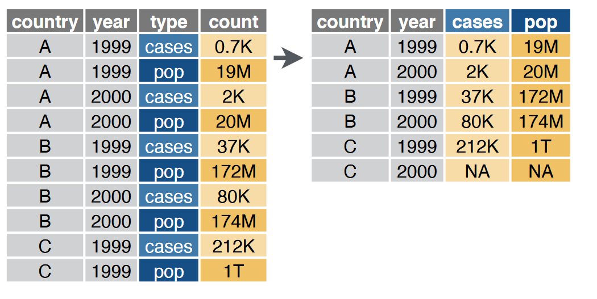
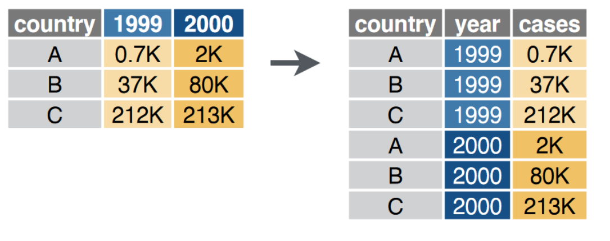
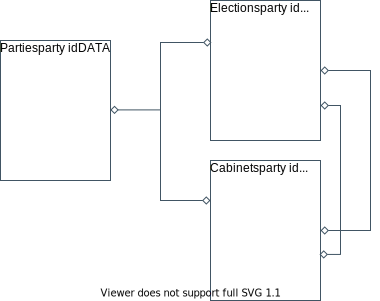
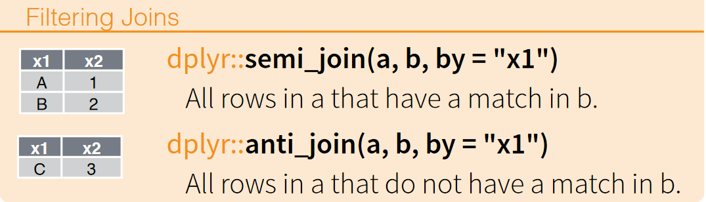

```{r setup, include=FALSE}

knitr::opts_chunk$set(echo = TRUE)

knitr::opts_chunk$set(
  fig.align = "center",
  fig.retina = 2,
  cache = FALSE # , echo=F, warning=F, message=F
)

# knitr::opts_chunk$set(fig.dim=c(4.8, 4.5), fig.retina=2, out.width="100%")

# install package management tool pacman
# install.packages("pacman")

# devtools::install_github("CorrelAid/datenguideR")

pacman::p_load(
  tidyverse,
  data.table,
  rio,
  patchwork,
  DT,
  modelsummary,
  collapse,
  forcats

)


# font_add_google(
#   name = "IBM Plex Sans",
#   family = "plex"
# )

# showtext_auto()


knitr::opts_chunk$set(
  message = FALSE,
  warning = FALSE
)
```


```{r set-ggplot-theme, include=FALSE}

theme_set(theme_classic() +
  theme(
    text = element_text(family = "plex", size = 25, colour = "#415564"),
    panel.background = element_rect(fill = "#f6f3f2"),
    plot.background = element_rect(fill = "#f6f3f2", color = "#f6f3f2"),
    panel.grid.major = element_line(colour = "#e8e8e8"),
    panel.grid.minor = element_blank(),
    legend.background = element_rect(fill = "#f6f3f2"),
    legend.box.background = element_rect(fill = "#f6f3f2"),
    axis.text = element_text(colour = "#415564"),
    axis.line = element_line(colour = "#415564"),
    axis.title = element_text(colour = "#415564"),
    axis.ticks = element_line(colour = "#415564"),
  ))

purple <- "#644155"

```


```{r xaringan-scribble, echo=FALSE}
xaringanExtra::use_scribble(pen_color = purple)
```


class: inverse, center, title-slide, middle

<style> .title-slide .remark-slide-number {
  display: none;
} </style>

# .title-wrap[Intro to Programming with R for Political Scientists]

<br />

## .header-fancy[Session 4: Data Wrangling II]

### Markus Freitag

### Geschwister Scholl Institute of Political Science, LMU

### [`r icons::icon_style(icons::fontawesome("twitter"), fill = "#415564")`](https://twitter.com/MarkusGFreitag) [`r icons::icon_style(icons::fontawesome("globe"), fill = "#415564")`](https://markusfreitag.netlify.app/)


### July 19, 2021

<a href="https://github.com/m-freitag" class="github-corner" aria-label="View
source on Github"><svg width="80" height="80" viewBox="0 0 250 250"
style="fill:#415564; color:#f6f3f2; position: absolute; top: 0; border: 0;
right: 0;" aria-hidden="true"><path d="M0,0 L115,115 L130,115 L142,142 L250,250
L250,0 Z"></path><path d="M128.3,109.0 C113.8,99.7 119.0,89.6 119.0,89.6
C122.0,82.7 120.5,78.6 120.5,78.6 C119.2,72.0 123.4,76.3 123.4,76.3 C127.3,80.9
125.5,87.3 125.5,87.3 C122.9,97.6 130.6,101.9 134.4,103.2" fill="currentColor"
style="transform-origin: 130px 106px;" class="octo-arm"></path><path
d="M115.0,115.0 C114.9,115.1 118.7,116.5 119.8,115.4 L133.7,101.6 C136.9,99.2
139.9,98.4 142.2,98.6 C133.8,88.0 127.5,74.4 143.8,58.0 C148.5,53.4 154.0,51.2
159.7,51.0 C160.3,49.4 163.2,43.6 171.4,40.1 C171.4,40.1 176.1,42.5 178.8,56.2
C183.1,58.6 187.2,61.8 190.9,65.4 C194.5,69.0 197.7,73.2 200.1,77.6 C213.8,80.2
216.3,84.9 216.3,84.9 C212.7,93.1 206.9,96.0 205.4,96.6 C205.1,102.4
203.0,107.8 198.3,112.5 C181.9,128.9 168.3,122.5 157.7,114.1 C157.9,116.9
156.7,120.9 152.7,124.9 L141.0,136.5 C139.8,137.7 141.6,141.9 141.8,141.8 Z"
fill="currentColor"
class="octo-body"></path></svg></a><style>.github-corner:hover
.octo-arm{animation:octocat-wave 560ms ease-in-out}@keyframes
octocat-wave{0%,100%{transform:rotate(0)}20%,60%{transform:rotate(-25deg)}40%,80%{transform:rotate(10deg)}}@media
(max-width:500px){.github-corner:hover .octo-arm{animation:none}.github-corner
.octo-arm{animation:octocat-wave 560ms ease-in-out}}</style>

---

# Overview

1. Intro + R-Studio and (Git)Hub

3. Base R & Tidyverse Basics

3.  Data Wrangling I

4. .hl[Data Wrangling II]

5. Data Viz

6. Writing Functions


---

# Workflow

- As I changed some file names and appended some things from last week, merging your forked
version with mine will surely generate some merge conflicts. 

- As we don't want to spend too much time on this, just download a `.zip` of the course repo and manually copy the files you want in your repo
or initialize a new repo.

- Navigate to `Session Scripts` and open `Session_3_script.R` (Same as Data Wrangling I).

- You will see a pre-formatted Script with all the steps I do on the slides.

- Explore as you follow. 

- If you have a second monitor, great! If not, split your screen.


---

# The Data

- We will use the [parlgov](http://www.parlgov.org/) database:

> ParlGov is a data infrastructure for political 
science and contains information for all EU 
and most OECD democracies (37 countries). 
The database combines approximately 1700 
parties, 1000 elections (9400 results), and 1600 cabinets (3900 parties).

- It's relational, i.e. consists of different tables (parties, elections, cabinets)
that can be **joined** using key variables. It can also be joined with the 
[partyfacts](https://partyfacts.herokuapp.com/) dataset that provides id's for 
many other datasets (e.g. CLEA, ESS). 

- It makes for pretty simple examples and hence we use it.

---

# The Data


Let's import the election data:

```{r}
parlgov_elec <- import("http://www.parlgov.org/static/data/development-cp1252/view_election.csv")
```

And filter for German elections:

```{r}
parlgov_elec_de <- parlgov_elec %>% # add, e.g., _de if we want to keep our original df 
  filter(country_name_short == "DEU")
```


---

# Dealing with factor variables: forcats

- Factor variables are useful, especially for plotting and modelling.

- With `factor_recode`, we can easily recode levels:

```{r}
parlgov_elec_de %>%
  mutate(election_type = fct_recode(election_type, # Coerces the type automatically from chr to fct.
    Bundestagswahl = "parliament",
    Europawahl = "ep"
  )) %>%
  count(election_type)

```

- With `fct_recorder` we can reorder factors (which will be useful for plotting
factors).

---

# Complex conditions: if_else and case_when

- Often, we also want to manipulate variables by means of complex conditions

- We will go deeper into control flow statements next week, but here is a sneak preview for data wrangling.

- Say we want to create a variable, "family", that puts parties into some party family
based on some arbitrary cutoff of the time-invariant left_right position:

--

```{r}
parlgov_elec_de <- parlgov_elec_de %>%
  mutate(family = if_else(left_right > 5, "right", "left"))
```

- Vectorised if: `if_else(condition, true, false)`. 

---

# Complex conditions: if_else and case_when 

- A generalised version of `if_else` is `case_when`.

- This is .hl2[very] useful:

```{r}
parlgov_elec_de <- parlgov_elec_de %>%
  mutate(family = case_when(
    left_right <= 2.5 ~ "left",
    left_right > 2.5 & left_right < 5 ~ "centre-left",
    left_right > 5 & left_right < 7.5 ~ "centre-right",
    left_right >= 7.5 ~ "right"))

```

- Two-sided formula: LHS = logical test; RHS = value to assign if the test
is `TRUE`.

- Values that do not fall into any of the conditions become `NA` which can
be prevented by adding `TRUE ~ something` as the last argument.

---
# tidyr: reshaping data

- Reshaping data is one of the key things you need to when cleaning/analysing data.

- [Two functions](https://raw.githubusercontent.com/rstudio/cheatsheets/master/data-import.pdf):

  - `tidyr::pivot_wider/longer()` is for reshaping from long (wide) to wide (long).

Two main arguments:

  - `names_*` and `values_*`, where "*" is "to" for `pivot_longer()` and "from" for 
  `pivot_wider()`.

--
  
.pull-left[

```{r, echo=FALSE, fig.align='center', out.width= "60%"}

```
<center> long &rarr; wide: `pivot_wider()` <center/> 
]

.pull-right[

```{r, echo=FALSE, fig.align='center', out.width= "60%"}

```
<br/>
<center> wide &rarr; long: `pivot_longer()` <center/> 
]

---

# tidyr: reshaping data

.hl[Example:]

- Say, we want a table of the vote shares of all major parties for each 
post-WW2 parliamentary election.

- Where each row is an election:


```{r}
wide <- parlgov_elec_de %>%
  filter(election_type == "parliament", vote_share >= 5, year(election_date) >= 1945) %>%
  select(election_date, party_name_short, vote_share) %>%
  pivot_wider(names_from = party_name_short, values_from = vote_share)

```

---

# tidyr: reshaping data

```{r, echo = FALSE}

datatable(wide,
  width = "100%",
  options = list(pageLength = 5, scrollX = TRUE)
)
```

---

# tidyr: reshaping data

- We can revert back to long format:

```{r}
long <- wide %>%
  pivot_longer(!election_date, names_to = "party_name_short", values_to = "vote_share") %>%
  filter(is.na(vote_share) == FALSE) # alternatively, simply set values_drop_na to TRUE in pivot_longer().
head(long)
```

---

# dplyr: joins

- Let's come back to the relational nature of our data...

---

# The Data

```{r, echo=FALSE, fig.align='center', out.width= "60%"}

```

---
  
# dplyr: joins

- Let's come back to the [relational](https://en.wikipedia.org/wiki/Relational_database) nature of our data...

- Remember, it consists of different tables, each representing one "entity type" 
(c.f. the 3rd. point in Wickham's tidy data framework)

- Each table has a unique key, representing each row. This key variable is used to link/join tables

- .hl[Suppose we want to join the party and the election table. How do we do that?]

---
  
# dplyr: joins

```{r, echo=FALSE, fig.align='center', out.width= "35%"}
knitr::include_graphics("Figs/joins.png")
```
```{r, echo=FALSE, fig.align='center', out.width= "35%"}

```

.hl2[Q] Which join do we need?

---
  
# dplyr: joins

We want a left join here...

.code70[
```{r}
parlgov_party <- rio::import("http://www.parlgov.org/static/data/development-utf-8/view_party.csv")

l_joined <- left_join(parlgov_elec_de, parlgov_party, by = "party_id")

head(l_joined)
```
]

.hl[Q] Why do we get `party_name_short.x` etc?

---

# dplyr: joins

- There are multiple matching (by name) variables in both tables.

- Hence, we need to specify all keys, or let `dplyr` do its magic: 

.code70[
```{r}
l_joined <- left_join(parlgov_elec_de, parlgov_party)

head(l_joined)
```
]

.font70[.hl[NOTE] Be careful if variables are named the same but measure different things.]

---

# Alternative approaches

- For every tidyverse function ("verb"), there is, of course, [a base
R way to do it](https://dplyr.tidyverse.org/articles/base.html).

- There are alternatives.

- For instance, the [data.table](https://cran.r-project.org/web/packages/data.table/vignettes/datatable-intro.html) 
and [collapse](https://raw.githubusercontent.com/SebKrantz/cheatsheets/master/collapse.pdf) (also comes with fast versions of summary stats and models) package provide great
and fast data wrangling alternatives.

- Data.table syntax is closer to the base R way of indexing/manipulating data frames.
Some like that.

- Don't be dogmatic. Use whatever suits you and your context. Mix stuff.

- You can find a great comparison of `data.table` and `dplyr` [here](https://atrebas.github.io/post/2019-03-03-datatable-dplyr/).

---

# A glimpse at data.table

- Comes with its own interpretation of data frames, "data tables". Special structure to work faster.

- Looks similar to basic `df[]` indexing but with alot of twists.

- Three elements:  .hl[which observations/rows] COMMA .hl2[transformations or other functions] COMMA grouping.

Rough `dplyr` equivalent:

<center> DT[.hl[`slice(); filter(); arrange()`], .hl2[`select(); mutate()`], `group_by()`] <center/>

---

# A glimpse at data.table

Example:

.pull-left[
```{r}
parlgov_elec_de %>% # add, e.g., _de if we want to keep our original df
  filter(party_name_short == "SPD") %>%
  summarise(mean(vote_share, na.rm = T))
  
```
]

.pull-right[
```{r}
setDT(parlgov_elec_de)

parlgov_elec_de[party_name_short == "SPD", mean(vote_share, na.rm = T)]
  
```
]

---

# Session 4 Problem Set/"Homework"

- We will not be able to do this task in class/break-out sessions. 

- I highly recommend doing it at home - it's great practice!

.hl[If you like, send me your solution via mail and I will comment/give you feedback!]

---

class: inverse, center, middle name: intro


# Next Up: Data Viz


```{r print pdf, include=FALSE}
pagedown::chrome_print("04_Data_Wrangling_II.html")
```

```{r xaringanExtra-share-again, echo=FALSE}
xaringanExtra::use_share_again()
```

```{r xaringanExtra-clipboard, echo=FALSE}
xaringanExtra::use_clipboard()
```