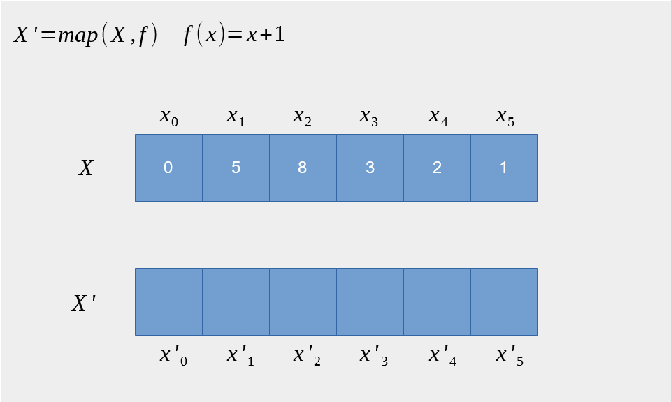

```{r setup, include=FALSE}

knitr::opts_chunk$set(echo = TRUE)

knitr::opts_chunk$set(
  fig.align = "center",
  fig.retina = 2,
  cache = FALSE # , echo=F, warning=F, message=F
)

# knitr::opts_chunk$set(fig.dim=c(4.8, 4.5), fig.retina=2, out.width="100%")

# install package management tool pacman
# install.packages("pacman")

# devtools::install_github("CorrelAid/datenguideR")

pacman::p_load(
  tidyverse,
  data.table,
  rio,
  patchwork,
  DT,
  modelsummary,
  collapse,
  forcats,
  hrbrthemes,
  palmerpenguins,
  purrr
)

# font_add_google(
#   name = "IBM Plex Sans",
#   family = "plex"
# )

# showtext_auto()

knitr::opts_chunk$set(
  message = FALSE,
  warning = FALSE
)

```


```{r set-ggplot-theme, include=FALSE}

extrafont::loadfonts()

plex <- theme_ipsum() +
  theme(
    text = element_text(colour = "#415564", family = "IBM Plex Sans"),
    plot.title = element_text(colour = "#415564", family = "IBM Plex Sans"),
    plot.subtitle = element_text(colour = "#415564", family = "IBM Plex Sans"),
    plot.background = element_rect(fill = "#f6f3f2", color = "#f6f3f2"),
    panel.border = element_blank(),
    strip.text = element_text(colour = "#415564"),
    axis.text = element_text(colour = "#415564"),
    axis.title = element_text(colour = "#415564")
  )

theme_set(plex)


purple <- "#644155"

```


```{r xaringan-scribble, echo=FALSE}
xaringanExtra::use_scribble(pen_color = purple)
```


class: inverse, center, title-slide, middle

<style> .title-slide .remark-slide-number {
  display: none;
} </style>

# .title-wrap[Intro to Programming with R for Political Scientists]

<br />

## .header-fancy[Session 5: Writing Functions]

### Markus Freitag

### Geschwister Scholl Institute of Political Science, LMU

### [`r icons::icon_style(icons::fontawesome("twitter"), fill = "#415564")`](https://twitter.com/MarkusGFreitag) [`r icons::icon_style(icons::fontawesome("globe"), fill = "#415564")`](https://markusfreitag.netlify.app/)


### 19.07.2021

<a href="https://github.com/m-freitag" class="github-corner" aria-label="View
source on Github"><svg width="80" height="80" viewBox="0 0 250 250"
style="fill:#415564; color:#f6f3f2; position: absolute; top: 0; border: 0;
right: 0;" aria-hidden="true"><path d="M0,0 L115,115 L130,115 L142,142 L250,250
L250,0 Z"></path><path d="M128.3,109.0 C113.8,99.7 119.0,89.6 119.0,89.6
C122.0,82.7 120.5,78.6 120.5,78.6 C119.2,72.0 123.4,76.3 123.4,76.3 C127.3,80.9
125.5,87.3 125.5,87.3 C122.9,97.6 130.6,101.9 134.4,103.2" fill="currentColor"
style="transform-origin: 130px 106px;" class="octo-arm"></path><path
d="M115.0,115.0 C114.9,115.1 118.7,116.5 119.8,115.4 L133.7,101.6 C136.9,99.2
139.9,98.4 142.2,98.6 C133.8,88.0 127.5,74.4 143.8,58.0 C148.5,53.4 154.0,51.2
159.7,51.0 C160.3,49.4 163.2,43.6 171.4,40.1 C171.4,40.1 176.1,42.5 178.8,56.2
C183.1,58.6 187.2,61.8 190.9,65.4 C194.5,69.0 197.7,73.2 200.1,77.6 C213.8,80.2
216.3,84.9 216.3,84.9 C212.7,93.1 206.9,96.0 205.4,96.6 C205.1,102.4
203.0,107.8 198.3,112.5 C181.9,128.9 168.3,122.5 157.7,114.1 C157.9,116.9
156.7,120.9 152.7,124.9 L141.0,136.5 C139.8,137.7 141.6,141.9 141.8,141.8 Z"
fill="currentColor"
class="octo-body"></path></svg></a><style>.github-corner:hover
.octo-arm{animation:octocat-wave 560ms ease-in-out}@keyframes
octocat-wave{0%,100%{transform:rotate(0)}20%,60%{transform:rotate(-25deg)}40%,80%{transform:rotate(10deg)}}@media
(max-width:500px){.github-corner:hover .octo-arm{animation:none}.github-corner
.octo-arm{animation:octocat-wave 560ms ease-in-out}}</style>

---

# Overview

1. Intro + R-Studio and (Git)Hub

2. Base R & Tidyverse Basics

3. Data Wrangling

4. Data Viz

5. .hl[Writing Functions]

6. A complete scientific workflow with R


---

# Workflow

- Navigate to `Session Scripts > Session 4` and open `Session_5_script.R`.

- You will see a pre-formatted Script with all the steps I do on the slides.

- Explore as you follow. 

- If you have a second monitor, great! If not, split your screen.


---

class: inverse, center, middle name: intro


# Functions and Functional Programming in R


---

# A Primer on Functional Programming

Even though not all functions are .hl[pure].font70[<sup>[1]</sup>], R is kind of a functional programming language as it has .hl2[first-class] functions.

>In general, programming languages impose restrictions on the ways in which computational 
>elements can be manipulated. Elements with the fewest restrictions are said to have first-class status. 
>Some of the “rights and privileges” of first-class elements are:

> - They may be named by variables.
> - They may be passed as arguments to procedures.
> - They may be returned as the results of procedures.
> - They may be included in data structures. ([Abelson et al. 1996](https://library.oapen.org/bitstream/handle/20.500.12657/26092/sicp.pdf?sequence=1): 102)

Because of these features, R "[lends itself to a style of problem solving centred on functions.](https://adv-r.hadley.nz/fp.html#fp)"

.font70[ <sup>[1]</sup> .hl[NOTE:] Not all functions are .hl[pure] as some functions output changes even with stable input (e.g. `rnorm()`).]

---

# Recap: Anatomy of a Function

- We have already written a very basic function on our own (session 2) and used a ton of base and user-written ones. 

- .hl[Recall:] Functions are objects. In math: a function maps elements from one set to another.

- Input $x$, rule $f$, output $f(x)$. This is pretty much the same in programming.

- A function in R consists of three components: an .hl2[argument list], a .hl2[body], and an environment.


Syntax:

--

.code70[
```{r, eval = FALSE}
name <- function(`COMMA-SEPARATED LIST OF ARGUMENTS`) {
  `FUNCTION BODY / OPERATIONS`
  return(THE VALUES OR OBJECTS WE WANT OUR FUNCTION TO RETURN) 
}
```
]

.font70[
.hl2[Note:] `return()` is not strictly necessary because R returns the last object you
defined within the function by default. But making explicit what gets returned is .hl[good style].]


---

# Function Environment

- A function in R consists of three components: an argument list, a body, and an .hl2[environment].

> When a function is called, a new environment (called the evaluation environment) 
> is created, [...]. This new environment is initially populated with the unevaluated 
> arguments to the function; as evaluation proceeds, local variables are created within it. ([R Language Definition](https://cran.r-project.org/doc/manuals/r-release/R-lang.html#Function-objects))

- So what happens is that instead of in your global environment, objects you create within a funtion are
local and only the output defined by `return` gets passed on. 

--

- [Lexical Scoping](https://adv-r.hadley.nz/functions.html#lexical-scoping)/How functions find values: The first place where
functions "look" for values of named objects is in inside the function. It only then turns to the parent environments.
The function environment is fresh every call. 


---

# An Example


```{r}

fun <- function(x = 3) { # we can specify a default value
  intermediate <- (2 * x + 3) / sqrt(3)
  output <- data.frame(input = x, output = intermediate)
  return(output) # good practice
}

fun()

fun(2)

```


---

# An Example

Scoping:

```{r}

x = 7

fun()

```

---

# Control Flow

> In computer science, [control flow](https://en.wikipedia.org/wiki/Control_flow) (or flow of control) is the order in which 
individual statements, instructions or function calls of an imperative program are executed or evaluated.

- There are two basic tools to control the flow of our code, especially in functions: .hl[conditions/choices] and .hl2[loops].

--

- .hl2[Loops]: Often, we want function to iterate over inputs. Most programming languages use `for` loops for this. In R, 
`for` loops iterate over elements in vectors:

```{r, eval = FALSE}
 for (element in vector) DO SOMETHING 
```

--

- .hl[Choices]:
```{r, eval = FALSE}
if (CONDITION) IS TRUE DO SOMETHING else DO SOMETHING ELSE
```

---

# Control Flow: Examples

.code80[
```{r, error = TRUE}
fun("hello")

fun <- function(x = 3) { 

  if (is.numeric(x)) {
  
  intermediate <- (2 * x + 3) / sqrt(3)
  output <- data.frame(input = x, output = intermediate)
  return(output)
  
  } else {

  stop("The input you provide has to be numeric.")   

  }
}

```
]

We can use `stop()` to overwrite the error message (see also `warning()` and `message()`)

---

# Control Flow: Examples


```{r, error = TRUE}
fun("hello")

```

--

`if` operates only on scalar booleans (i.e. a single `TRUE/FALSE`)...

.code70[
```{r}
set.seed(666)

x <- rnorm(10)

if (x < 0) {
  "negative"
} else {
  "positive"
}

```
]

Mostly used in function building/when a scalar condition is needed/sufficient (see previous slide).

---

# Control Flow: Examples

Combining the scalar `if` with a `for` loop to "grow" an object telling us whether 
each element of `x` is `positive` or `negative` iteratively:

.code60[
```{r}

nested <- function(z = NULL) { # setting default to NULL
  
  y <- vector(mode = "character", length = 10) # initialise, e.g., an empty vector; preallocate memory
# y <- NULL This works too, but R has to grow, copy, paste and allocate memory at each step. This is slow. 

  for (i in 1:length(z)) { # We can reference the element with whatever name, i is just convention.

    if (z[i] < 0) {
      y[i] <- "negative"
    } else {
      y[i] <- "positive"
    }
  }
  
  return(y)

}

nested(z = x)

```
]

---

# Control Flow: Examples

We already got introduced to .hl[vectorised] versions of if statements: `if_else()`/`ifelse()` and the more general `case_when()`:

```{r}

vectorised <- function(z = NULL) { 

  ifelse(x < 0, "negative", "positive")

}

vectorised(z = x)

```

That's much easier (and faster)!

---

# Vectorisation

- We already got introduced to vectorised versions of if statements: `if_else()`/`ifelse()` and the more general `case_when()`.

What is meant by "vectorised"?

- You often read the following: it means that the function is applied on every element of an vector/list at .hl2[once].


---

# Vectorisation

```{r}

fun <- function(x = 3) { 
  intermediate <- (2 * x + 3) / sqrt(3)
  output <- data.frame(input = x, output = intermediate)
  return(output) 
}

fun(c(1,2,3))

```

---

# Vectorisation


- We already got introduced to vectorised versions of if statements: `if_else()`/`ifelse()` and the more general `case_when()`.

What is meant by "vectorised"?

- You often read the following: it means that the function is applied on every element of an vector/list at .hl2[once].

- Except it's not literally doing that...

.hl[Technical Fine Point:] At the core, everything you type in R is a vector. [Actually](https://www.r-bloggers.com/2014/04/vectorization-in-r-why/), 
in vectorised functions, the vector get's just passed on to the compiled code of 
a lower-level language (e.g. C++) which itself consists of... loops.


---

# Do I need to explicitly write a loop?

- I like loops.font70[<sup>[2]</sup>], but in R they are sometimes slow .hl[if not done properly] (see sec. Ch. of the [R Inferno](https://www.burns-stat.com/pages/Tutor/R_inferno.pdf)). What makes loops slow is the stuff you do inside of them.
  
- There are a few ways out:

--
  
  - Vectorising the stuff inside. E.g., if you can replace a nested `for` loop containing `if` statements with `ifelse()`, do it. [Recursion](https://en.wikipedia.org/wiki/Recursion_(computer_science)) (`if`) is
  also slower than loops in R.

  - Another way is to use .hl2[functionals]: functions that take a vector and 
other functions as arguments.

  - For instance, with `lapply()` from the `*apply()` family or the equivalent but optimized tidyverse alternative 
`purrr::map()`, we can make .hl2[applying a function to every element of a vector and returning a list] often a one-liner.

.font70[ <sup>[2]</sup> .hl[Comment:] That's why I also like Julia for some (simulation) tasks. I can 
get away more easy with writing [fugly loops](https://elbersb.com/public/posts/interaction_simulation/).]

---

# Do I need to explicitly write a loop?

Why do these .hl2[functionals] work well?

They...

  - automatically pre-allocate memory (we can do that manually too, see Ex. a few slides ago!).

  - make use of compiled C code.

.hl[NOTE:] They are not really vectorized functions (or faster) but make .hl2[syntax cleaner]
and make it easier to not screw up. 

The use of functionals to avoid looping is related to/a core topic of Hadley-Style .hl2[functional programming].

---

# Functionals

The syntax of the `*apply()` family and `purrr::map()` is virtually identical.

We can also specify the data structure we want to get with `map_*`:

```{r}

is_positive <- function(z) {
    if (z < 0) {
      "negative"
    } else {
      "positive"
    }
}

purrr::map_chr(x, is_positive)


```

---

# Functionals

```{r}

purrr::map_df(penguins, mean, na.rm = TRUE)

penguins %>%
  summarise(across(.cols = everything(), mean, na.rm = TRUE))


```

---

# Functionals

Functionals can take anonymous functions...

.code60[
```{r}
purrr::map_df(penguins, function(x) is.numeric(x))

```
]

Anonymous functions are also quite useful in combination with dplyr...

.code60[
```{r}
penguins %>%
  select(function(x) is.numeric(x)) %>%
  head(1)
```
]


---

# Functionals

There are also a few useful shorthands to make this less verbose...

```{r}
purrr::map_df(penguins, ~ is.numeric(..1))
```

You can use `..1` (or `.x` and `.y`) and so forth for multiple-argument functions.

---

# Functionals


```{r, echo = FALSE, out.width= "60%"}

```

Source: [Wikipedia](https://bit.ly/3dWfYYD). Maps are common in pretty in programming languages.


---

class: inverse, center, middle name: intro

# Examples: Functional Programming and ggplot


---

# Combining map() and ggplot()

.pull-left[
.font80[  
We have already learned facets as a way to make a multi-panel plot. 
But what if we just want multiple plots? Copying can be tedious.

Witness the power of the functional approach...
]

.code45[
```{r funp, tidy=FALSE, eval = FALSE}

penguin_scatter <- function(df, x, y, color = NULL, shape = NULL) {

  ggplot(df, aes_string(x = x, y = y, color = color, shape = shape)) +
    geom_point(size = 2, alpha = 0.6) +
    geom_smooth(method = "lm", se = FALSE) +
    scale_colour_brewer(palette = "Dark2") +
    theme_ipsum()
  
}

penguin_scatter(penguins,
  x = "flipper_length_mm", 
  y = "body_mass_g",
  color = "species",
  shape = "species"
)


```
]
]
.pull-right[

```{r funp-out, ref.label = "funp", echo = FALSE}
```

]


---

# Combining map() and ggplot()

.font80[
Getting a tibble of all distinct combinations of names of numeric variables (not gonna lie, took some time to cook it up - specifying it manually would've probably been easier)...
]

.code60[
```{r}
combs <- penguins %>%
  select(function(x) is.numeric(x), -year) %>% # get only numeric cols, except year
  names() %>% # get a character vector of column names
  tibble(y = ., x = .) %>%  # put it into two tibble columns
  tidyr::expand(x, y) %>% # all combinations of a variable in a data set
  transmute(y = pmin(y, x), x = pmax(y, x)) %>% # some "sorting" shenanigans to get distinct combs
  distinct() %>% # cleaning stuff that did not get picked up in the step above
  filter(y != x) # "
combs

```

]

---

# Combining map() and ggplot()

Letting the magic happen with `pmap()`.

.font70[
> .hl2[Function Description:] These functions are variants of map() that iterate over multiple arguments 
simultaneously. They are parallel in the sense that each input is processed 
in parallel with the others, not in the sense of multicore computing. 
They share the same notion of "parallel" as base::pmax() and base::pmin(). 
map2() and walk2() are specialised for the two argument case; pmap() and 
pwalk() allow you to provide any number of arguments in a list. 
Note that a data frame is a very important special case, in which 
case pmap() and pwalk() apply the function .f to each row.
]

```{r}

plots <- pmap(combs, function(x,y) penguin_scatter(penguins,
  x = x,
  y = y,
  color = "species",
  shape = "species"
))

```

---

# Combining map() and ggplot()

.code45[
```{r, fig.width = 17, fig.height = 8}
patchwork::wrap_plots(plots) # wrap_plots makes it easy to take a list of plots and add them into one composition, along with layout specifications.
```
]

---

# Normalize Writing Functions

.font80[ 
- On your way towards a proficient R user, you should try to integrate writing 
functions in your workflow. Mastering functions (and OOP) also makes switching between 
languages more easy!

.hl[When to write a function?]

  - Whenver you copy some block of code a few times, there surely is a way to save
some lines with a function. This makes your code much more readable!

  - A typical application case in statistics is simulations.

  - If you want to plot multiple things, functions become extremely handy! 
]

--

.font80[ 
.hl2[Stylistic Rules]

  - To make your functions readable for your future self, name them and their arguments
  properly. Specifity > brevity.

  - Comment more complex functions extensively or you will be doomed!

You wrote a neat function you need alot in your daily workflow? Consider [packaging it](https://www.mzes.uni-mannheim.de/socialsciencedatalab/article/r-package/)!
]

---
  
# A Brief Aside on Debugging in R-Studio

While you should be relatively well equipped to understand some errors or warnings
that R throws, there will often be situations where you simply have no clue.

When writing a function, avoid this by writing several small functions instead of a single large one. 

  - Most of the time, you can get away by googling errors and consulting, e.g. [stackoverflow](https://stackoverflow.com/).

  - Or, you can use [`errorist`](https://github.com/r-assist/errorist) to automatically search errors and warnings when
  they arise.

You can also use [R-Studios debugging tool](https://support.rstudio.com/hc/en-us/articles/205612627-Debugging-with-the-RStudio-IDE) 
to peek under the hood of a function, execute it line by line and spot the error.

I mostly enter the debugging mode with: 

```{r, eval = FALSE}
debugonce(your_function)
your_function()
```


---

# Some Words on Linting

When writing functions, keeping your code clean is especially important for legibility.

While the first `session_script` contains some information on structuring scripts,
we did not touch on code so far. 

Linting means stylistically standardizing code/ a software that tells you which lines of code are badly formatted/have errors. 
Other languages have fix conventions, R does not. But see the [tidyverse style guide](https://style.tidyverse.org/).

While Rstudio has some auto code formatting and code and snippet suggestions, it does not natively provide
code linting.

My Tipp is to use [`styler`](https://github.com/r-lib/styler), an Rstudio addin.

Let's take a look...


---

class: inverse, center, middle name: intro

# Session 5: Problem Set
<br/>
### If you want to master functions there is only one way...
<br/>
## Get your hands dirty!


```{r print pdf, include=FALSE}
pagedown::chrome_print("05_Functions.html")
```

```{r xaringanExtra-share-again, echo=FALSE}
xaringanExtra::use_share_again()
```

```{r xaringanExtra-clipboard, echo=FALSE}
xaringanExtra::use_clipboard()
```
